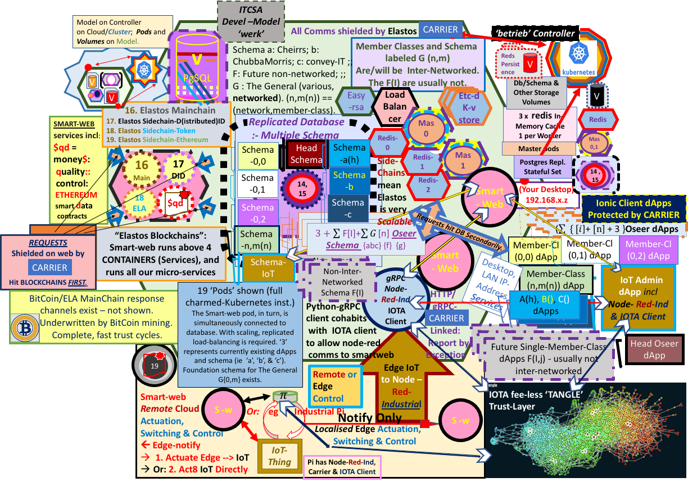

## INTRODUCTION:

# CHEIRRS
Project based on  Lxd, Juju, Charms and Kubernetes; merged with Cyber Republic's Elastos Smartweb gRPC-based Blockchain and Database Server. Database ORM, reflection (at initialisation) and querying uses SQLAlchemy. The blockchain end of a transaction occurs first, followed by writing or reading of data to or from Postgres, via the "redis" cluster on the Kubernetes installation. 

gRPC protocols replace the older style REST APIs, for communicating requests, and data inputs, from the client, and responses from the blockchain &/or database back to the client; all this occurs through the smart-web server, employing a "microservices" architecture. Here the gRPC protocols are implemented in Python. The smart-web server has Carrier installed onboard, guaranteeing security. Carrier is also installed automatically on the Ionic dApp clients as well as manually on the IoT Edge client/servers (running 'node-red').

To tackle a full Kubernetes installation locally, ideally you would need a 32 GB RAM (minimum); 250 GB SSD; + HDD: PC (x86_64). eg an Extreme Gaming Computer. If you intend to include Machine Learning/AI capabilities, your Kubeflow installation will go much more easily with an 8 core Host processor rather than a 4 core one. You really need an Accelerator NVIDIA GPU of at least 10GB vRAM. ITCSA intended on using a 24GB NVIDIA Tesla K80, however the item was dysfunctional. Beware e-Bay!

The following figure represents the 'betrieb' controller with its 'werk' model, as opposed to 'lernenmaschine', the other model, on 'kubefluss' controller (based on microk8s). We install the Kubeflow (kubefluss/lernenmaschine) model first.

We base initial development such as this locally. It's cheaper!



The schema above are labeled G(n,m) for the internetworked, multiple member class dApps. In reality there are only n schema with the member classes (m) being a data field in every table within the nth schema. In this way we can keep all transactions internal to a network on the same schema. The nth network is on the nth schema. The single member class, non-internetworked dApps (F(i)) are likewise constituted of all members of a network or dApp subscribers' group, on their own schema. Although this is the case with the set F(i), within a single network ie schema ie dApp, we will be able to use the field for a member's id to distinguish between members' different dApp requirements and proliferate different (custom) tables and processes within a single network/dApp/schema. While the same is ideally the case for the G(n,m) set, such individual member Tables and dApps being theoretically possible, the design and coding would be expensive.

The Internet of Things (IoT) system revolves around the IoT node-red servers on the Edge Client/Servers, being in communication with node-red server residing with in the cloud and communicating via gRPC protocol buffers with separate Smart-Web servers. The smart-web server receives notifications from the node-red server and passes on relevant IoT events to both blockchains and database. 

The actual "Things" generating messages and signals are connected at the sites by raspberry-pi "edge" clients or similar (eg one of Canonical's Partners offers "Industrial Pi" with Ubuntu Certification, ready for the Ubuntu "Core" reduced-footprint Operating System). The administration of the IoT system occurs on the IoT dApps, connected both via node-red as well as python-grpc to the server(s). The IoT Admin dApp can be split effectively to allow networks to be under your own control and respomsibility. Both notification and actuation are possible, however with actuation, the response time of the system needs to be considered, as a cloud based server may not satisfy the sub-millisecond requirements of some machinery. Edge-based servers would need to handle such operations. The systems such as this are mainly communicating Notifications to the Smart-Web Servers for database and blockchain recording purposes and to allow IoT Administrators to act as appropriate. That is, any electronic control required is provided either by the IoT devices themselves, or via components like Industrial Pi servers, locally, for groups of devices. All communications are shielded securely on networks by Elastos Carrier, requiring the Carrier-Native and its Nodejs "wrapper" package to allow node.js apps to access Carrier.

The technology of the fee-free IOTA "Trust Layer", being developed for IoT, is already at version 2.0 and has plans to implement Smart Contracts (presumably fee-less also). ITCSA is incorporating IOTA as our provided Trust Layer of choice for IoT operations. IOTA adds a layer of reference against which all IoT actions can be validated. The absence of fees is made possible by having each transaction validate 2 others before completion. In this way there is no "Mining" involved, as such. IOTA is designed to support Industry 4.0 Standards, and is currently popular in Europe (due to the German-originated Industrie 4.0 standards, with IOTA's headquarters in Berlin. Language translation is natively provided in German, French and Italian). The IOTA response  cycle-time is measured in seconds.

We utilise one "oseer" schema per network/user-schema, so there is one schema for each of the n networks, and one for each of the F(i) non-internetworked future dApps, as well as one for each of the A, B and C dApps (Community Housing, RealEstate and convey-IT, respectively). Our schema called 'das_fuhrwerk' is the Head Overseeing Schema, for top level customer on-boarding, usage tracking and payments, to "oversee the overseers" and to provide our own company's Enterprise dApp for our accounting, planning and administration purposes.

You need to develop initially on docker. ITCSA uses Ubuntu 20.04 as the host platform.
You will not need an Extreme Gaming level of computer for Docker-based (initial - eg. database) work without Kubernetes.

See our website at https://www.itcsolutions.com.au/kubernetes-yaml-file-example/ for an older but more visual idea of this project and others.

The Front End dApp corresponding to this project is at https://github.com/john-itcsolutions/au.com.itcsolutions.cheirrs.0.01. It uses the Ionic Platform for web app (in our cases, "distributed app") development. However the Ionic system must be used in conjunction with the newly developing 'Elastos Essentials' package. This package will include all necessary interfaces for the Elastos Ecosystem from the points of view of both developers and users. You can follow this development process (expected to introduce the first stable distribution around July, 2021) at:

https://github.com/elastos/Elastos.Essentials

Note that you may develop entirely on and for dektop computers with Ionic to get to a stage ready for deployment, however to make that dApp work with Elastos
you would be required to employ the Elastos.Essentials utilities to connect to the required systems. If you develop also for mobile devices you need to upload the Essentials ".apk" file for Android and obtain various DID's and keys to securely connect on (for example) a USB-connected real mobile device using the Android Studio's "adb" tool. Aside from Android, iOS systems are currently being developed by Elastos for Essentials.

You would also require some dev tools and the openjdk for Java, as well as nodejs@12.x:

```
# Base requirements 
sudo apt -y install openjdk-8-jdk build-essential curl dirmngr apt-transport-https lsb-release ca-certificates
# Install NodeJS 12 instead of 8 or 10
curl -sL https://deb.nodesource.com/setup_12.x | sudo -E bash -
sudo apt -y install nodejs
```

As well as installing Ionic & Cordova (which enables single-pass coding for iOS and Android as well as desktop - ie browser - platforms):

`sudo npm i -g @ionic/cli`

`sudo npm i -g cordova`

The Ionic docs are at:

https://ionicframework.com/docs

In an Ionic dApp (either React or Angular-based) you will find `manifest.json`.

This file is where you can whitelist websites (including the cloud database/blockchains and server site, even if local).

All websites are blacklisted by default, until you whitelist the sites required by your dApp.

This enables the Elastos Carrier system to do its magic and connect in a private and ultra-secure way to websites, with no websockets used.

(see the Elastos Whitepaper at https://www.elastos.org/downloads/elastos_whitepaper_en.pdf)

Currently (July 2021) the Elastos Developer Documentation does not address development with the new Elastos Essentials.

Our dApp Front End looks like this at the current stage of development:


## ________________________________________________________________________________________________________________________

## Get:

Docker for Ubuntu: https://docs.docker.com/engine/install/ubuntu/  - SAFEST WAY!

Remember to

`sudo usermod -aG docker $USER && newgrp docker`

after install is complete.

The docker-based development on this project is adapted from the code in:

https://github.com/cyber-republic/elastos-smartweb-service  (smartweb-server, providing blockchain access, containerised by ITCSA)

and

https://github.com/cyber-republic/python-grpc-adenine  (smartweb-client, database query client with Python)

and

lxd, juju, kubernetes and Kubeflow. Also:

https://jaas.ai/u/stub/postgresql (PostgreSQL without PostGIS initially)

We rely on the "redis" cluster of the kubernetes charmed ecosystem to provide the in-memory, "key-value" query cache servers for the database transactions,

TensorFlow by Google. 

The predominant language used to code for this project is Python (here, mainly version 3.8). The Front End dApp is in typescript, a version of javascript. The IoT system ("node-red") is written in node.js, a server-compataible version of javascript, both for edge and server machines. Both the Front End dApp and the IoT system communicate with the smart-web blockchain-and-database server using the python gRPC protocol buffers, which can be found in the python-grpc-adenine github repo by cyber-republic.

______________________________________________________________

## Preliminaries: NOTE The following remarks on installing the Nvidia and Cuda systems constitute a work in progress only:

With the exception of noting that this:

`nvidia-smi`

should produce a positive message, if you want to use your nvidia gpu with CUDA capacities as part of the system; we cannot advise further.

________________________________________________________________


## We continue by installing Kubeflow to obtain a controller compatible with this Juju/TensorFlow environment:
________________________________________________________________

(In case lxd is not already installed, this is how, however it is most likely to be present initially:

`sudo snap install lxd`

`sudo lxd init`

We need to choose "yes" to the "lxd clustering?" option (not the default), and storage type must be "dir" and ipv6 should be "none", otherwise all default answers are fine.)


## 'KUBEFLOW', TensorFlow and Machine Learning (Artificial Intelligence & Statistical Learning)

Unfortunately the charmed system is mainly oriented for Public Clouds when it comes to the Kubeflow charm bundle. However in combination with microk8s, much can still be achieved ..

From the outermost directory in your working system (on a second HDD if available), check out this repository locally:

`git clone https://github.com/juju-solutions/bundle-kubeflow.git`

`cd bundle-kubeflow`

The below commands will assume you are running them from the bundle-kubeflow directory.

Then, follow the instructions from the subsection below to deploy Kubeflow to microk8s.

Microk8s is the only way to easily obtain a working Kubeflow/tensorflow installation on your localhost without paying cloud fees ..

Setup microk8s on the Ubuntu vm:

`sudo snap install microk8s --classic`

Next, you will need to add yourself to the microk8s group:

`sudo usermod -aG microk8s $USER && newgrp microk8s`

`sudo su - $USER`   (quick reset of terminal)

On the Host, you'll need to install these snaps to get started:

`sudo snap install juju --classic`

`sudo snap install juju-wait --classic`

`sudo snap install juju-helpers --classic`

If you

`juju clouds`

you will aleady find that there exists a 'microk8s/localhost' cloud. Later we will set up another 'localhost/localhost' cloud with different properties, for the main blockchains, database schema and database servers in a kubernetes installation.

Finally, you can run these commands to set up kubeflow/TensorFlow, but you have to have the cloned "bundle-kubeflow", from the above section, available:

Note: After this installation of the 'lernenmaschine' model on the 'kubefluss' controller in a 'kubeflow-lite' package (we edited the cli script and names), we will be installing a 'betrieb' controller with 'werk' model. 

Initially:

`sudo apt install python3-pip`

`pip3 install click`

`cd /path/to/bundle-kubeflow`

If you need to choose 'kubeflow lite' (recommended for initial development), you can edit the relevant code in scripts/cli.py and note that you may also alter the controller name, if you take care to alter the commands you issue.

`python3 scripts/cli.py microk8s setup --controller kubefluss`

The upcoming deploy-to command allows manually setting a public address that is used for accessing Kubeflow on MicroK8s. However in some deployment scenarios (such as local development), you would need to configure MicroK8s to use LAN DNS instead of the default of 8.8.8.8. To do this, edit the coredns configmap with this command:

`microk8s.kubectl edit configmap -n kube-system coredns`

Edit the line with 8.8.8.8 8.8.4.4 to use your local DNS, e.g. 192.168.1.1. You will need to use the arrow keys and the 'insert' and 'delete' keys carefully! Save and exit as for vim.

If you make mistakes during editing, it is safest to:

`juju destroy-controller kubefluss --destroy-all-models --destroy-storage `

and restart from 

`python3 scripts/cli.py microk8s setup --controller kubefluss`

followed by editing the coredns configmap again.

     _____________________________________________

Only when the coredns configmap is correct for your LAN:

`python3 scripts/cli.py deploy-to kubefluss`

(Passthrough should already be natively enabled to your Accelerator GPU.)

Check the status of the installation with:

`watch -c juju status --color`

or:

`juju status`

for a static summary.

On Host, you could switch between other possible controllers by noting the current controllers known to juju:

`juju controllers`

and then selecting the target for switching, and:

`juju switch <target-controller-name>`

Within controllers you may substitute <target-model-name> and use:

`juju switch <target-model-name>`

to move between models on the same controller.

The following image is a screenshot of the `lernenmaschine` model's status board after successful installation of "kubeflow-lite":


     
Note that we have actually found it impossible to sustain a kubeflow controller on the microk8s cloud at the same time as we are running the second controller on the localhost cloud referred to in the text below the kubeflow Manual (following). The host randomly reboots. The latter cloud works alone, and, as it represents the more business-end of our business, we continue with no kubeflow. A singleton setup may work better with Kubeflow installed alone on a microk8s/localhost host. There is sufficient RAM onboard our host according to the system monitor, so at this stage the cause is unknown. There were less crashes after installing a Mechanical HDD, but still unsatisfactory. One possibility may be to employ a MAAS (Metal as a Service) installation as the basis for a solo Desktop setup. Stay tuned.
____________________________________________________________________________________

## USING KUBEFLOW

### Main Dashboard

Most interactions will go through the central dashboard, which is available via
Ambassador at `/`. The deploy scripts will print out the address you can point your browser to when they are done deploying.

### Pipelines

Pipelines are available either by the main dashboard, or from within notebooks
via the [fairing](https://github.com/kubeflow/fairing) library.

Note that until https://github.com/kubeflow/pipelines/issues/1654 is resolved,
you will have to attach volumes to any locations that output artifacts are
written to, see the `attach_output_volume` function in
`pipline-samples/sequential.py` for an example.

### Argo UI

You can view pipelines from the Pipeline Dashboard available on the central
dashboard, or by going to `/argo/`.

### TensorFlow Jobs

To submit a TensorFlow job to the dashboard, you can run this `kubectl`
command:

    kubectl create -n <NAMESPACE> -f path/to/job/definition.yaml

Where `<NAMESPACE>` matches the name of the Juju model that you're using,
and `path/to/job/definition.yaml` should point to a `TFJob` definition
similar to the `mnist.yaml` example [found here][mnist-example].

[mnist-example]: charms/tf-job-operator/files/mnist.yaml

### TensorFlow Serving

See https://github.com/juju-solutions/charm-tf-serving


## Removing

### Kubeflow model

To remove Kubeflow from your Kubernetes cluster, first run this command to
remove Kubeflow itself:

`juju destroy-model lernenmaschine --destroy-storage`

If you encounter errors while destroying the model, you can run this command
to force deletion:

`juju destroy-model lernenmaschine --yes --destroy-storage --force`

Alternatively, to simply release storage instead of deleting it, run with this
flag:

`juju destroy-model lernenmaschine --release-storage`

### Kubeflow controller

You can destroy the controller itself with this command:

    # For microk8s
`juju destroy-controller $(juju show-controller | head -n1 | sed 's/://g') --destroy-storage`

## Tests

To run the test suite included in this repository (bundle-kubeflow), start by installing the Python dependencies:

`pip install --user -r requirements.txt -r test-requirements.txt`

Next, ensure that you either have the `juju-helpers` snap package installed, or you have
the `kubectl` binary available with `~/.kube/config` set up correctly.

Then, run the tests with this command:

`pytest tests/ -m <bundle>`

where `<bundle>` is whichever bundle you have deployed, one of `full`, `lite`, or `edge`.

If you have Charmed Kubeflow deployed to a remote machine with an SSH proxy available
(for example, if you have MicroK8s running on an AWS VM), you can run the tests like this to run them against the remote machine:

`pytest tests/ -m <bundle> --proxy=localhost:9999 --url=http://10.64.140.43.xip.io/ --password=password`

Additionally, if you'd like to view the Selenium tests as they're in progress, you can
pass in the `--headful` option like this:

`pytest tests/ -m <bundle> --headful`
 ______________________________________________________________

# There is a possibility of setting up a Postgres database with PostGIS and Open Street Maps. It appears that the procedure Canonical have taken with Kubeflow above utilises MongoDB during installation, a no-SQL, non-relational database system, as one of the persistence stores as well as Mariadb (a resurrection of the opensource version of mysql) within the "kubeflow" model (which we are calling `lernenmaschine` ..)

As noted below, it is possible, using cross-model referencing, and "offers", to enable an application on a separate controller and/or model, eg the kubeflow model in the uk8s controller, (or just a separate model on the same controller) to access the PostgreSQL/PostGIS database ('haus') on the 'betrieb' controller and the 'werk' model (see following) therein.

See below at the "## Set up Cross-Model Referenced "offer" .. " heading.

But which `<application-name>` (in kubeflow model) to use as requiring connection to the provided db?

To be continued.

_________________________________________________________________

## A Second Model on a second controller:

(The database schema for ITCSA's project are private and available only under certain conditions.)

Bootstrap a new controller - but this time on the 'localhost' cloud - (when you installed juju, it recognised that localhost was already installed, and juju created a 'localhost' cloud for you to use. Verify this with `juju clouds`):


`juju bootstrap localhost betrieb`

Add a model named "werk"

`juju add-model werk`

Deploy the 'Calico' Kubernetes Charm, since default CNI provider 'Flannel' does not provide all necessary services:

`juju deploy cs:~containers/bundle/kubernetes-calico-1070`

`juju config kubernetes-master proxy-extra-args="proxy-mode=userspace"`

`juju config kubernetes-worker proxy-extra-args="proxy-mode=userspace"`

At this stage your juju assemblage is converging towards stability. You can observe the status of the assemblage with

`watch -c juju status --color` or, `juju status` for short.

It may take a few hours if your network is slow. Be patient.

When you see everything 'green', you may continue.

Deploy PostgreSQL (Juju sorts out Master and Replicating servers automatically).

`juju deploy postgresql pg-a`

`juju add-unit pg-a`
     
`juju config pg-a admin_addresses=127.0.0.1,0.0.0.0,<ip-addr-worker-0>,<ip-addr-worker-1>,<ip-addr-worker-2>`

Deploy a Redis cluster for in-memory caching:

`juju deploy cs:~omnivector/bundle/redis-cluster-1`
     
*******************************************************

________________________________________________________________
 
## DATABASE: Internals

## Copy sql scripts; Build Database Schema:
     
`git clone recurse-submodules https://github.com/john-itcsolutions/cheirrs.git`

From Host, in .... /cheirrs/elastos-smartweb-service/grpc_adenine/database/scripts folder,

`juju scp *.sql <machine number of postgresql master>:/home/ubuntu/`

## The following command would be possible, as presented, only after you are positively identified, gain our trust, and sign an agreement to work with us, in order to obtain these backup files. Or, develop your own (see below)!

`cd ../../../../ && juju scp dbase_setup*.sh <machine-number-postgresql-master>:/home/ubuntu && juju scp *.sql <machine-number-postgresql-master>:/home/ubuntu && cd ../ && juju scp *.sql <machine number of postgresql master>:/home/ubuntu/`

where some of the relevant .sql backup files are outside the 'cheirrs' repository, and generally unavailable publically.

exec into master db container:

`juju ssh <machine number of postgresql master>`

Now you are inside postgres master container, in the /home/ubuntu directory:

`sudo passwd postgres`

Enter your new postgres user's password twice.

`su postgres`

     Note that you could simply take any schema you have available, suitable to ANSI or 
     Postgres standards, and edit it in a good editor replacing the occurrences of the schema name, 
     in an sql backup of your schema, with the series of schema names you can find in 
     "dbase_setup_1.sh", in turn (we leave out public, tiger, tiger_data, and topology as 
     they are provided by the overall process here).
     
     Alternatively you could edit "dbase_setup_1.sh" to reflect your own database and its 
     set of schemata, and place copies of your .sql schema backups in the parent directory of the 
     cloned "cheirrs" directory. The above scripts will then work for you.
     
`./dbase_setup_1.sh`

(.. this takes 1.2 hours on my machine, with a mechanical HDD. Don't worry about any syntax errors visible when the scripts have run)

`\dt ` should reveal no instances (in default public schema)

`set search_path to cheirrs;`

.. now, `\dt` should reveal a full set of 600+ tables in 2 categories: 1) accounting_<xyz> and 2) uc_<uvw> ('uc_' for use_case). Or in most people's cases it will reveal whatever you provided in the first place.

Fewer results will appear for:

`set search_path to cheirrs_oseer;`

and, for example;

`set search_path to das_fuhrwerk;`

when you run 

`\dt`

In postgres master machine:

Exit psql shell:

`\q`


__________________________________________________________________

## Getting PostGIS and Open Street Maps

Inside your postgresql Master (

`juju ssh <postgresql_Master_machine_number>`, or if you are already acting as user 'postgres' on postgresql-master, simply `exit` 

)

As user ubuntu (if acting as "postgres" `exit`as "postgres" is not a sudoer) & get ubuntugis repo:

`sudo add-apt-repository ppa:ubuntugis/ppa`

`./dbase_setup_2.sh`

`su postgres`

`./dbase_setup_3.sh`

(Note for the smart-web blockchains to work, gmu must exist as a user with password gmu, and with usage permission to all schema.)

Check Schemas: there should be 'cheirrs', 'cheirrs_oseer', 'chubba_morris', 'chubba_morris_oseer', 'convey_it', 'convey_it_oseer', 'das_fuhrwerk', 'the_general', 'the_general_oseer', 'tiger', 'tiger_data', 'topology', and 'public'.

`\dn`

Check off users:

`\du`

then

`\dt` (to reveal tables in default public schema) you should see 7 tables.

Try:

`select * from users;`

You should see the single registered user's details.

`\q`

`exit`

`exit`

You're back on Host.

_________________________________________________________________

## Set up Cross-Model Referenced "offer" for apps on other models to access PostgreSQL solo installation on this controller called 'betrieb', within this cmr-model called 'werk'.

[cmr-model == "Cross-Model Referenced"-model]

(If not on "betrieb" controller)

`juju switch betrieb`

`juju offer pg-a:db`

then, if you `juju status` in the werk model you will see, at the foot of the output, a reference to the Offer.

An application (and users - here admin and ubuntu) set to `consume` the postgres service from a different model and controller (eg here: from the 'kubefluss' controller, ie from the 'lernenmaschine' model), is connected with (this needs to be run while in lernenmaschine model):

`juju grant admin consume kubefluss:admin/werk.pg-a`

`juju grant ubuntu consume kubefluss:ubuntu/werk.pg-a`

.. then the authorised user (in the lernenmaschine model - see above) may use:

`juju add-relation <application>:db kubefluss:admin/werk.pg-a:db`

`juju add-relation <application>:db kubefluss:ubuntu/werk.pg-a:db`

to connect "application" to the database (in werk model)from 'kubefluss' controller, ie from the lernenmaschine model (in this case).

_______________________________________________________________

ALSO:

## Blockchains-Database Server (werk model) 

We turn to finish setting up the Blockchain/Database gRPC Server Deployment.
     
_______________________________________________________________
     
## You need to repeat the following for worker-1 after completing the setup on worker-0
     
________________________________________________________________
     

NOTE: As we don't own or control the elastos sub-modules, and since the `elastos-smartweb-service/grpc_adenine/database/__init__.py` file is not fully usable as it is, in the elastos-smartweb-service module (as-cloned), we have included ITCSA's version of `__init__.py` in a folder in the cheirrs root directory. This version caters for initialising the SQLAlchemy interface from the existing database, and generating a full set of Database Models, using SQLAlchemy's ORM & methods of Database Metadata Reflection. However you need to edit this file carefully to suit your own database, at your
` cheirrs/TO_BE_COPIED_INTO_smartweb-service/TO_elastos-smartweb-service.grpc_adenine.database/__init__.py` (in local clones of this repo) to enable it to work properly as a Python init file. This init file will be run by the system before running the server at /grpc_adenine/server.py. You would have to keep these 2 versions of `__init__.py` in sync with each other if you need to edit `__init__.py`, and want to use your own github account, for example.
   
     After this, on host:

`cd path/to/cheirrs/elastos-smartweb-service`

The .env.example file here needs to be filled-in with the correct database name, database server address and port as well as the correct addresses for the smart-web virtual machine. ie the blockchain addresses and ports to access the smart-web environment. It then will need to be copied to the worker machine as ".env" (but if you follow the instructions below, you will be copying .env.test and .env as edited to cheirrs/TO*/*service/.env and .env.test. 
     
     There is no need for a separate Carrier Node as smart-web contains a Carrier implementation.

The blockchain server ip-addresses in the .env, and .env.test files need to match the address of the kubernetes-worker-0, -1 and -2 machines, here, as appropriate. Also the database details will require alteration.
     
Presuming you have obtained a fresh clone of "elastos-smartweb-service" with "recurse-submodules" at 'cheirrs' cloning-time, you will need to ensure the __init__.py within grpc_adenine/database directory is updated to our repo's version (as discussed above). Actually there is no need to alter the __init__.py 
file in the repo, rather in the cheirrs/TO*/*database/, which is where the file will be copied (soon) to the vm's.
     
You also need to treat the "run.sh" and "test.sh" (which are in cheirrs root directory also) identically. So we will copy them soon to elastos-smartweb-service over the existing "run.sh" and "test.sh". Postgres connections in Kubernetes are not possible in the fashion assumed by "run.sh" and "test.sh" in elastos by default.

So in the host's (in cheirrs root) "TO_BE_COPIED_TO_smartweb-service" directory are scripts and modules in .sh, .env, .env.test and .py that have had to be altered from those provided in the experimental Elastos-smartweb-service repo. These should be copied over the existing files in the worker-0 machine. Therefore:

`exit`

`cd ....path/to/cheirrs`

`juju scp TO*/*service/*.sh <machine-number-worker-0>:/home/ubuntu/el* && juju scp TO*/*service/.env* <machine-number-worker-0>:/home/ubuntu/el*`

`juju scp TO*service/TO*adenine/*.py <machine-number-worker-0>:/home/ubuntu/elastos-smartweb-service/grpc_adenine`

`juju scp TO*service/TO*database/*.py <machine-number-worker-0>:/home/ubuntu/elastos-smartweb-service/grpc_adenine/database`

`juju scp TO*service/TO*python/*.py <machine-number-worker-0>:/home/ubuntu/elastos-smartweb-service/grpc_adenine/stubs/python`

Re-enter worker-0:

`juju ssh <machine-number-worker-0>`

`cd el*`

`./run.sh`
     
     NOTE: Before moving on to copy files to worker-1, the .env and .env.test files in the elastos-smartweb-service/ directories 
     will need to contain the appropriate addresses for the particular worker upon which the .env files are to be copied. Thus the 
     .env files in the workers -0 and -1 are each different. Be sure to re-edit before copying.
 

.. and wait and watch .. and examine logs in case of errors, which are in the machines (`juju ssh <machine-number>`) at /var/log/juju/filename.log. If all is well, you should be looking at the blockchains' log, on stdout, as the cycles roll every 30 seconds. The logs of units housed by other machines are available on those machines.
     
     There is also a dbase_report.txt in /home/ubuntu on each vm.


              ____________________________

(Notes; 
     
1. You are user 'ubuntu' here (in all vm's), so if you, or any user, needs a new password, just

`sudo passwd ubuntu` or `sudo passwd <user-name>`

2. To add, for example, 2 load-balancer units, simply

`juju add-unit -n 2 kubeapi-load-balancer`

)
_________________________________________________________________________________________________
     
     The following is a screenshot of the status board after successful installation:
     

     
     stdout of Blockchains looks like:
     

     

_____________________________________________________________


## TESTING the smartweb-service/Blockchains/Postgresql System

     Enter kubernetes-worker-0 and:
     
     `cd el*`
     
     `./test.sh`
     
     We are having difficulties with the jwt token and key system for entry authentication to the smart-web server ..
     
To be continued ..
_____________________________________________________________

     
## Enter kubernetes-worker-2, to set-up an IoT server with Python-gRPC, 
   node-red-industrial and IOTA client, on their own vm.
     
`juju ssh <machine-number-worker-2>`

(To install nodejs and npm, needed for the Carrier wrapper and to connect 
with gRPC as well as the IOTA node.js client:)
     
`curl -sL https://deb.nodesource.com/setup_12.x | sudo -E bash -`

`sudo apt -y install nodejs`
     
)  
     
To get Node-Red-Industrial:

`sudo snap install node-red-industrial` on the Host (acting as an Edge server)
     
Also, in worker-2 (`juju ssh <machine-number-worker-2>`,
     
`sudo snap install node-red-industrial`
     
     Node-Red-Industrial is packaged as a Flask (Python) application. On Host, 
     we need to set 2 environment variables with:
     
`export FLASK_APP=node-red-industrial`
     
`export FLASK_ENV=development`
     
     Also it is a good idea to add the binary code location for the snap app to your PATH. 
     For now;
     
`cd /snap/node-red-industrial/30/bin`
     
`flask run`
     
     and go to your own host's LAN address, on a new tab in the 
     browser, with port `1881`,
     then, in worker-2, `node-red`, and go to your worker-2's address with port 1881
     in a browser tab on your Host.
     
    These 2 pages can interact, and generate and forward messages, events and commands.
     
     Eventually the idea is to be able to "log" and respond (in appropriate timeframes
     corresponding to the message origin and content) to events considered as "exceptional"
     in some way. The events and messages (originating on iot devices connected to "edge" 
     raspberry-pi (or Industrial Pi) units or similar, in the field) will be logged on 
     blockchains and database, via javascript functions in node-red wrapped in Carrier and 
     using the gRPC protocols on worker-2, to the "smart-web" server. Before logging or any 
     IoT Admin response occurs, worker-2 verifies the IoT action via the IOTA client (connected to the 'Tangle'), 
     originally reported by Node-Red-Industrial on the Edge server.
     
     As noted elsewhere, the required response times of some machinery and systems means 
     sub-millisecond cycles, which cannot be achieved without dedicated Edge-client/server 
     support geographically close to sites, when actuation is involved. Otherwise, 
     notification functions can be handled directly to the Cloud. 
     
     In order for the node-red server on the workers to talk to the "smart-web" servers we need 
     to clone the smartweb client from elastos in worker-2:
     
`git clone https://github.com/cyber-republic/python-grpc-adenine.git`
     
     Follow the README.md instructions on the repo site to build the client.
     
     Similarly we need to allow (Elastos) Carrier-shielded communication between "edge" (here, Host),
     and the workers. For this we require the Carrier Native SDK and to follow this by installing the 
     Carrier Nodejs Wrapper package on the Host. The Smart-Web servers also require the Nodejs wrapper to be 
     installed to enable communication with the onboard Carrier node.
     This would need to also occur on Real-World Edge Clients running node-red.
     
     https://github.com/elastos/Elastos.NET.Carrier.Nodejs.SDK and 
     https://github.com/elastos/Elastos.NET.Carrier.Native.SDK have details.
     
     We are currently having a problem related to the same errors when we ran "test.sh" from 
     smart-web, when we try to complete the connection between node-red and smart-web via the grpc client 
     (cohabiting with smart-web). It appears to relate to configuration/provision of a jwt token at 
     authentication in both cases.
     
     The installation of IOTA client proceeds as follows:
     
`mkdir iota && cd iota`
     
`npm i @iota/client`
     
     Add a file called `iota_connector.js` with the following content:
     
```
     async function run() {
     const {
     ClientBuilder
     } = require('@iota/client');
    // client connects to a node that has MQTT enabled
     const client = new ClientBuilder()
     .node('https://api.hornet-2.testnet.chrysalis2.com')
     .build();
     client.subscriber().topics(['milestones/confirmed', 'messages', 'messages/referenced']).subscribe((err, data) => {
     console.log(data);        // To get the message id from messages `client.getMessageId(data.payload)` can be used
     })
    await new Promise(resolve => setTimeout(resolve, 1500));    // unsubscribe from 'messages' topic, 
     //will continue to receive events for 'milestones/confirmed', etc
     client.subscriber().topics(['messages']).unsubscribe((err, data) => {
     console.log(data);
     })
     }
run()
```
     
Please refer to https://client-lib.docs.iota.org/docs/libraries/nodejs/examples for a full explanation of all topics 
to which an application may subscribe on IOTA. The approach we have taken here is to rely on Message exchanges on MQTT 
for validation of IoT actions and events.
     
     The launch of the client occurs with:
     
`node iota_connector`   from the iota root directory.
     
     By choosing the node.js version of the IOTA client, we get the ability to easily communicate with the other 
     apps on the worker-2 vm.
     
     At the command line a typical launch of node-red looks like:
     
  
     
     A typical node-red site appears as follows (all clients - eg raspberry-pi edge clients - 
     as well as the server can show pages similar to this). Here is shown the "Edge" site page mimicked by 
     the Host, ideally enclosed in Carrier (however the Nodejs wrapper, needed to access Native Carrier, is 
     missing a file currently ..):
     

     
     To match this, a server might look like:
     

     
     It is easy to see in the first shot (of Edge client) the increased processing necessary when an actuation 
     is to be controlled from the server via the edge client, ie. in "second_fleet".

_________________________________________________________________________________________________________________________________________
     
     
     When fully developed, the system on the betrieb controller is a fully cloud-compliant Kubernetes System, ready to be deployed to any Cloud.
     Normally, the database is setup on the cloud separately and connected to the rest of the system later. You would be required to develop your own gRPC system calls (in node.js) to the .proto files (in Python) in the Front End dApps, and the corresponding methods (ie microservices in Python) on the Smart-Web server.
     Good luck! For refs see:

See 'Using Kubeflow' above.

Also refer to any official docs on TensorFlow and its history, background and usage.

## (In particular, visit either https://statlearning.com/ (the Authors' own website) - or -  https://dokumen.pub/introduction-to-statistical-learning-7th-printingnbsped-9781461471370-9781461471387-2013936251.html -  & download "An Introduction to Statistical Learning"; 2017. James, Witten, Hastie, Tibshirani. 441p.). 

Read it slowly, carefully and repeatedly. This represents only the theoretical framework for the more general field of TensorFlow and Machine Learning. One develops, builds, trains, tests and finally deploys Machine Learning "models". 

## (For a more mathematical treatment you can obtain a copy of 'The Mother of Statistical Learning Texts' at https://web.stanford.edu/~hastie/Papers/ESLII.pdf Elements of Statistical Learning 2nd Ed; 2008. Hastie, Tibshirani, Friedman. 764p.)

AI (Artificial Intelligence) includes further technical solutions to involve the results of the deployment of models in military, industrial and commercial production applications, to achieve economic and strategic benefits.
_________________________________________________________________

## NOW: How to use a spatial database in connection with TensorFlow?

I.
A Brain and a 3 dimensional spatial database are both correspondent in meta-structure. It is possible to map 3-D neuronal graphs to a spatial database.

II.
Is it possible, however to model a more-than-3-dimensional Graph and represent it on a PostGIS database?

III.
It appears to us that since it is possible to serialise all data on a sequential computer, it should be possible to store multi-dimensional graphs in a hyper-spatial database. Or is the use of MongoDB indicating that data for these already multi-dimensional Tensors is better stored in a non-relational, non-SQL structure?

IV.
Even if desirable, could an adaptation of PostGIS allow hyperspatiality? 

V.
How would we connect PostgreSQL + PostGIS in the above 'betrieb' controller, with TensorFlow on the 'kubefluss' controller in the 'lernenmaschine' model, if only to obtain the benefits possible from a strictly GEO-spatial database system?

VI.
At the least we can say PostGIS is commonly used to ADD the informational capacities introduced by a geo-spatial database to Machine Learning Models.

VII.
Therefore one question is: Is there anything to be gained by Hyper-Dimensional Spatialities? Can Machines be taught and learn within a hyper-spatial cosmos? Is that not what they are doing already, mathematically, in (v)RAM? Can a hyper-spatial database benefit anyone?

VIII.
By adding a capacity for a quasi-synchronous (fourth), "Time" dimension, some capabilities in the form of a truly Dynamic and Responsive Database could be achieved, compared to "chronostatic" geospatial databases. What could these capacities be? Would it be necessary to provide more than is currently provided
in the way of time recording?

IX.
But could there be other uses for further dimensionality, in the fields of Machine Learning? Or is that already obvious to the cognoscenti? Possibly it would be the case that one would require a Database whose spatial dimensionality is a software-design variable, determined individually for each application, but not hard-wired into the Database as a whole?

X.
Financial modeling (now involving M/L) encompasses certain agreed principles which have been worked out over centuries to retain some rights for customers and borrowers relating to Banks. In the same way as rules have been established to fix financial modeling used by Banks and Money Lenders to ensure fairness to customers, why not apply a similar approach to the Global Financial Models used by Pharmaceutical Companies to determine world pricing. Extra constraints are required to save lives and relieve suffering. Some of us believe profits are killing and disabling people who would otherwise have a chance in this world. Just ask your doctor about Type 1 Diabetes in the so-called third world.

_________________________________________________________________

   ## My LinkedIn:
                                                                              
   https://www.linkedin.com/in/john-lloyd-olsen/                                                                           
_________________________________________________________________

