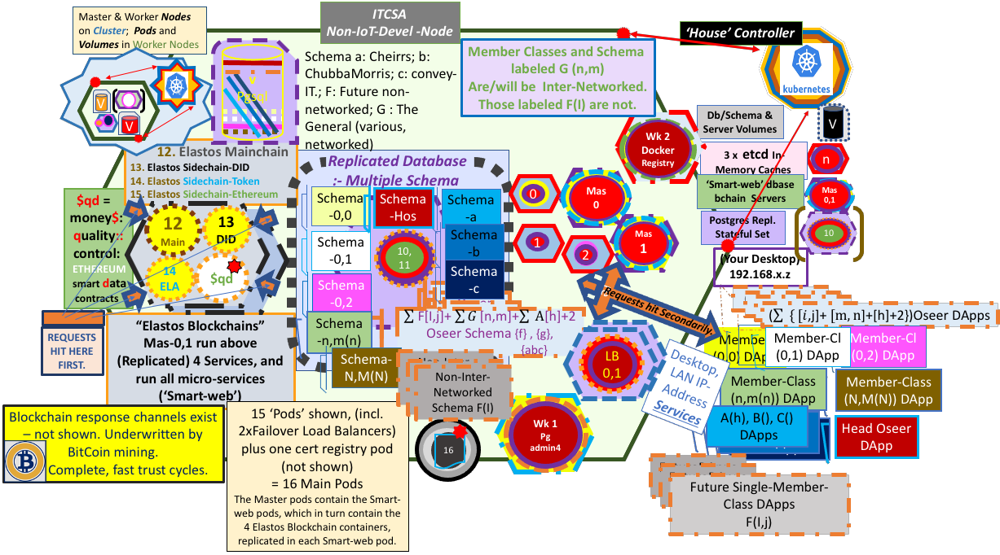

## INTRODUCTION:

# CHEIRRS
Project based on  Lxd, Juju, Charms and Kubernetes merged with Cyber Republic's Elastos Smartweb gRPC-based Blockchain and Database Server and SQLAlchemy.

To tackle a full Kubernetes installation, ideally you would need a 32 GB RAM; 250 GB SSD; + HDD: PC (x86_64). eg an Extreme Gaming Computer. If you intend to include Machine Learning/AI capabilities, your Kubeflow installation will go much more easily with an 8 core Host rather than a 4 core one. You really need an Accelerator NVIDIA GPU of at least 10GB vRAM. ITCSA is using a 24GB NVIDIA Tesla K80.

We base initial development such as this locally. It's cheaper!



You need to develop initially on docker. ITCSA uses Ubuntu 20.04 as host platform.
You will not need an Extreme Gaming level of computer for Docker-based (initial - eg. database) work without Kubernetes.

See our website at https://www.itcsolutions.com.au/kubernetes-yaml-file-example/ for an older but more visual idea of this project and others.

The Front End dApp corresponding to this project is contained in a private repository. It uses the Ionic Platform for web app (in our cases, "distributed app") development. However the Ionic system must be used in conjunction with the newly developing 'Elastos Essentials' package. This package will include all necessary interfaces for the Elastos Ecosystem from the points of view of both developers and users. You can follow this development process (expected to introduce the first stable distribution around July, 2021) at:

https://github.com/elastos/Elastos.Essentials

You would also require some dev tools and the openjdk for Java, as well as nodejs@12.x:

```
# Base requirements 
sudo apt -y install openjdk-8-jdk build-essential curl dirmngr apt-transport-https lsb-release ca-certificates
# Install NodeJS 12 instead of 8 or 10
curl -sL https://deb.nodesource.com/setup_12.x | sudo -E bash -
sudo apt -y install nodejs
```

As well as installing Ionic:

`sudo npm i -g @ionic/cli`

The Ionic docs are at:

https://ionicframework.com/docs

Currently (April 2021) the Elastos Developer Documentation does not address development with the new Elastos Essentials.

## ________________________________________________________________________________________________________________________

## Get:

Docker for Ubuntu: https://docs.docker.com/engine/install/ubuntu/  - SAFEST WAY!

Remember to

`sudo usermod -aG docker $USER && newgrp docker`

after install is complete.

The docker-based development on this project is adapted from the code in:

https://github.com/cyber-republic/elastos-smartweb-service  (smartweb-server, providing blockchain access, containerised by ITCSA)

and

https://github.com/cyber-republic/python-grpc-adenine  (smartweb-client, database query client with Python)

and

lxd, juju, kubernetes and Kubeflow. Also:

https://jaas.ai/u/stub/postgresql (PostgreSQL without PostGIS initially)

We rely on the "etcd" component of the kubernetes charm-bundle to provide the in-memory, "key-value" query cache servers for the database transactions,
replacing Redis with this.

TensorFlow by Google. 

The predominant language used to code for this project is Python (here, mainly version 3.8).

______________________________________________________________

## Preliminaries: NOTE The following remarks on installing the Nvidia and Cuda systems constitute a work in progress only:

The system's nouveau drivers need to be blacklisted in /etc/modprobe.d as they block NVIDIA Driver installation, and you need to find a basic xorg.conf template to save in /etc/X11/xorg.conf.

`sudo bash -c "echo blacklist nouveau > /etc/modprobe.d/blacklist-nvidia-nouveau.conf"`

`sudo bash -c "echo options nouveau modeset=0 >> /etc/modprobe.d/blacklist-nvidia-nouveau.conf"`

Confirm:

`cat /etc/modprobe.d/blacklist-nvidia-nouveau.conf`

Also, we need to remove blacklisting nvidia entries

`sudo grep nvidia /etc/modprobe.d/* /lib/modprobe.d/*`

And remove all entries for nvidia.

Update kernel initramfs:

`sudo update-initramfs -u`

(After installation, NVIDIA can configure the X server with:

`sudo nvidia-xconfig`

but it requires you to provide a basic one-device/screen initial file for nvidia to work on).

It is recommended to disable the X11 Server (the normal Window System and Manager) as you perform the following reboot. This involves the normal 'sudo reboot' but as the computer comes back up, you need to tap the `Esc` key continually until you open the bootloader (Grub) menu. You need to select the 'Advanced options' item with arrow key down one and `Enter`, then `e` (to edit) at the top kernel entry in the menu. Then at the file revealed, you arrow down to the line beginning with "linux", hit the `end` key, and enter `nomodprobe` after a space from the end of the existing line. Then hit `F10` and the system will reboot into a non-X-server (vesa-driven) mode such that the NVIDIA driver will not be blocked by the X11 server, as you install the NVIDIA/CUDA software. The quality of screen experience obtainable on the vesa system is definitely inferior to that available using the normal X server, however the performance is restored after the next reboot, until you repeat the above "nomodeset" kernel parameter setting procedure.

`sudo reboot`

In "vesa" mode:

Now,

check your system following here: https://docs.nvidia.com/cuda/cuda-installation-guide-linux/index.html#ubuntu-installation

Install kernel headers as per above documentation for the kernel matching your running version. The versions must match exactly. Follow above docs for an installation procedure (not recommended).

OR:

Alternatively you may use the system based package manager and installer 'synaptic' (recommended by NVIDIA themselves) with:

`sudo apt install synaptic`

`sudo apt install build-essential`

`cat /proc/version`

The previous command gives the running kernel version and gcc version it was compiled under. The gcc version mentioned there must match exactly with the result of:

`gcc -v`

(the version of gcc running currently)

Make sure you also have the linux-source files for your kernel:

`sudo apt install linux-source`

and check /usr/src for existence of correct kernel header and kernel source files.

Run synaptic from Applications tile.

Carefully mark all nvidia and cuda packages, and relevant kernel modules for your version as well as relevant nvidia/cuda libraries for installation. Then 'apply' to install. This is quite a laborious process. Try to be patient and careful. Pay attention to kernel versions, as the installer errors out with non-matching versions amongst software. Now, ensure you have a basic single-device-and-screen /etc/X11/xorg.conf file for NVIDIA to work with, and:

`sudo nvidia-xconfig`

IF YOU HAVE BEEN SUCCESSFUL, UPON REBOOT YOU WILL FIND THE FOLLOWING WORKS:

`sudo reboot`

(No need to use vesa again)

`nvidia-smi`

should produce a positive message.

________________________________________________________________


We continue by installing Kubeflow to obtain a controller compatible with this Juju/TensorFlow environment:
________________________________________________________________


You first install lxd:

`sudo snap install lxd`

`sudo lxd init`

storage type must be "dir" and ipv6 should be "none", otherwise all default answers are fine.


## 'KUBEFLOW', TensorFlow and Machine Learning (Artificial Intelligence & Statistical Learning)

Unfortunately the charmed system is mainly oriented for Public Clouds when it comes to the Kubeflow charm bundle. However in combination with microk8s, much can still be achieved ..

From the outermost directory in your working system (on a second HDD if available), check out these repositories locally:

`git clone https://github.com/john-itcsolutions/cheirrs.git`

`git clone https://github.com/juju-solutions/bundle-kubeflow.git`

`cd bundle-kubeflow`

The below commands will assume you are running them from the bundle-kubeflow directory.

Then, follow the instructions from the subsection below to deploy Kubeflow to microk8s.

Microk8s is the only way to easily obtain a working Kubeflow/tensorflow installation on your localhost without paying cloud fees ..

Setup microk8s on the Ubuntu Host:

`sudo snap install microk8s --classic`

Next, you will need to add yourself to the microk8s group:

`sudo usermod -aG microk8s $USER && newgrp microk8s`

`sudo su - $USER`   (quick reset of terminal)

On the Host, you'll need to install these snaps to get started:

`sudo snap install juju --classic`

`sudo snap install juju-wait --classic`

`sudo snap install juju-helpers --classic`

If you

`juju clouds`

you will aleady find that there exists a 'microk8s/localhost' cloud. Later we will set up another 'localhost/localhost' cloud with different properties, for the main blockchains, database schema and database servers in a kubernetes installation.

Finally, you can run these commands to set up kubeflow/TensorFlow, but you have to have the cloned "bundle-kubeflow", from the above section, available:

Note: After this installation of the 'kubeflow' model on the 'uk8s' controller, we will be installing a 'house' controller with 'dbase-bchains' model. The order of installation of these packages is important (why? because it doesn't ever work the other way!). So follow it.

Initially:

`sudo apt install python3-pip`

`pip3 install click`

`cd /path/to/bundle-kubeflow`

`python3 scripts/cli.py microk8s setup --controller uk8s`

The upcoming deploy-to command allows manually setting a public address that is used for accessing Kubeflow on MicroK8s. However in some deployment scenarios (such as local development), you may need to configure MicroK8s to use LAN DNS instead of the default of 8.8.8.8. To do this, edit the coredns configmap with this command:

`microk8s.kubectl edit configmap -n kube-system coredns`

Edit the line with 8.8.8.8 8.8.4.4 to use your local DNS, e.g. 192.168.1.1. You will need to use the arrow keys and the 'insert' and 'delete' keys carefully! Save and exit as for vim.

If you make mistakes during editing, it is safest to:

`juju destroy-controller uk8s --destroy-all-models --destroy-storage `

and restart from 

`python3 scripts/cli.py microk8s setup --controller uk8s`

followed by editing the coredns configmap again.

     _____________________________________________

Only when the coredns configmap is correct for your LAN:

`python3 scripts/cli.py deploy-to uk8s`

(Passthrough should already be natively enabled to your Accelerator GPU.)

On Host, you could switch between other possible controllers by noting the current controllers known to juju:

`juju controllers`

and then selecting the target for switching, and:

`juju switch <target-controller-name>`

Within controllers you may substitute <target-model-name> and use:

`juju switch <target-model-name>`

to move between models on the same controller.

______________________________________________________________

## USING KUBEFLOW

### Main Dashboard

Most interactions will go through the central dashboard, which is available via
Ambassador at `/`. The deploy scripts will print out the address you can point your browser to when they are done deploying.

### Pipelines

Pipelines are available either by the main dashboard, or from within notebooks
via the [fairing](https://github.com/kubeflow/fairing) library.

Note that until https://github.com/kubeflow/pipelines/issues/1654 is resolved,
you will have to attach volumes to any locations that output artifacts are
written to, see the `attach_output_volume` function in
`pipline-samples/sequential.py` for an example.

### Argo UI

You can view pipelines from the Pipeline Dashboard available on the central
dashboard, or by going to `/argo/`.

### TensorFlow Jobs

To submit a TensorFlow job to the dashboard, you can run this `kubectl`
command:

    kubectl create -n <NAMESPACE> -f path/to/job/definition.yaml

Where `<NAMESPACE>` matches the name of the Juju model that you're using,
and `path/to/job/definition.yaml` should point to a `TFJob` definition
similar to the `mnist.yaml` example [found here][mnist-example].

[mnist-example]: charms/tf-job-operator/files/mnist.yaml

### TensorFlow Serving

See https://github.com/juju-solutions/charm-tf-serving


## Removing

### Kubeflow model

To remove Kubeflow from your Kubernetes cluster, first run this command to
remove Kubeflow itself:

    juju destroy-model kubeflow --destroy-storage

If you encounter errors while destroying the model, you can run this command
to force deletion:

    juju destroy-model kubeflow --yes --destroy-storage --force

Alternatively, to simply release storage instead of deleting it, run with this
flag:

    juju destroy-model kubeflow --release-storage

### Kubeflow controller

You can destroy the controller itself with this command:

    # For microk8s
    juju destroy-controller $(juju show-controller | head -n1 | sed 's/://g') --destroy-storage

## Tests

To run the test suite included in this repository (bundle-kubeflow), start by installing the Python dependencies:

    pip install --user -r requirements.txt -r test-requirements.txt

Next, ensure that you either have the `juju-helpers` snap package installed, or you have
the `kubectl` binary available with `~/.kube/config` set up correctly.

Then, run the tests with this command:

    pytest tests/ -m <bundle>

where `<bundle>` is whichever bundle you have deployed, one of `full`, `lite`, or `edge`.

If you have Charmed Kubeflow deployed to a remote machine with an SSH proxy available
(for example, if you have MicroK8s running on an AWS VM), you can run the tests like this to run them against the remote machine:

    pytest tests/ -m <bundle> --proxy=localhost:9999 --url=http://10.64.140.43.xip.io/ --password=password

Additionally, if you'd like to view the Selenium tests as they're in progress, you can
pass in the `--headful` option like this:

    pytest tests/ -m <bundle> --headful
______________________________________________________________

# There is a possibility of setting up a Postgres database with PostGIS and Open Street Maps. It appears that the procedure Canonical have taken with Kubeflow above utilises MongoDB, a no-SQL, non-relational database system, as one of the persistence stores as well as Mariadb (a resurrection of the opensource version of mysql) ..

As noted below, it is possible, using cross-model referencing, and "offers", to enable an application on a separate controller and/or model, eg the kubeflow model in the uk8s controller, (or just a separate model on the same controller) to access the PostgreSQL/PostGIS database ('house') on the 'house' controller and the 'dbase-bchains' model (see following) therein.

See below at the "## Set up Cross-Model Referenced "offer" .. " heading.

But which `<application-name>` (in kubeflow model) to use as requiring connection to the provided db?

To be continued.

_________________________________________________________________

## A Second Model on a second controller:

(The database schema for ITCSA's project are private and available only under certain conditions.)

In a host terminal, from a second HDD if available, to save working files in case of a crash:

Bootstrap a new controller - but this time on the 'localhost' cloud - (when you installed juju, it recognised that localhost was already installed, and juju created a 'localhost' cloud for you to use. Verify this with `juju clouds`):

(You should change ownership of files on your system to your own username. Do this with 

`sudo chown -R <your-username-on-linux> ~ && sudo chown -R <your-username-on-linux> /tmp`

). Then:

`juju bootstrap localhost house`

Add a model named "dbase-bchains"

`juju add-model dbase-bchains`

Deploy the Kubernetes Charm

`juju deploy cs:bundle/charmed-kubernetes-559`

`juju config kubernetes-master proxy-extra-args="proxy-mode=userspace"`

`juju config kubernetes-worker proxy-extra-args="proxy-mode=userspace"`

`juju deploy cs:~containers/keepalived`

```
juju add-relation keepalived:juju-info kubeapi-load-balancer:juju-info
juju add-relation keepalived:lb-sink kubeapi-load-balancer:website
juju add-relation keepalived:loadbalancer kubernetes-master:loadbalancer
juju add-relation keepalived:website kubernetes-worker:kube-api-endpoint
```

`export VIP=<virt_ipaddr of load balancer machine>`

`export VIP_HOSTNAME=<your-hostname>`

```
juju config keepalived virtual_ip=$VIP
juju config keepalived vip_hostname=$VIP_HOSTNAME
```

`juju config kubeapi-load-balancer extra_sans="$VIP $VIP_HOSTNAME"`

`juju config kubernetes-master extra_sans="$VIP $VIP_HOSTNAME"`

Once the new service shows "Ready" in juju status;

```
juju remove-relation kubernetes-worker:kube-api-endpoint kubeapi-load-balancer:website
 juju remove-relation kubernetes-master:loadbalancer kubeapi-load-balancer:loadbalancer
 ```

At this stage your microk8s/juju assemblage is converging towards stability. You can observe the status of the assemblage with

`watch -c juju status --color` or, `juju status` for short.

It may take a few hours if your network is slow. Be patient.

When you see everything 'green', you may continue.

Deploy PostgreSQL (Juju sorts out Master and Replicating servers automatically).

`juju deploy -n 2 postgresql --storage pgdata=lxd,100G postgresql`

________________________________________________________________

## Build and deploy docker-registry from Canonical LTD's repo:

(a separate Canonical Ltd charm, which needs to be installed in the dbase-bchains model by:) 

`git clone https://github.com/CanonicalLtd/docker-registry-charm.git`

 to your outer working directory, and building and deploying  the charm with:

`sudo snap install charm --classic`

`cd docker-registry-charm`

`charm build -o ../docker-registry`

*******************************************************

`cd ../docker-registry` 

`juju deploy ./docker-registry --to 9 --series  focal --force`

(we deploy to kubernetes-worker/2)

`juju add-relation docker-registry:cert-provider easyrsa:client`

`juju add-relation docker-registry:certificates easyrsa:client`

`juju config docker-registry auth-basic-user='admin'  auth-basic-password='localhost'`

You need to copy any CA.cert in your /etc/ssl/certs folder to <machine-number-docker-registry>:/home/ubuntu/, ie:

`juju scp /etc/ssl/certs/xyz.pem <machine-number-docker-registry>:/home/ubuntu/`

You also need to make your own host.crt and host.key from a self signed certificate, and then:

`juju scp path/to/host.key <machine-number-docker-registry>:/home/ubuntu/`

`juju scp path/to/host.crt <machine-number-docker-registry>:/home/ubuntu/`

`juju config kubernetes-master image-registry=$REGISTRY`

You may need to wait until the registry installation has stabilised, then:

(PLEASE NOTE: )
```
export IP=`juju run --unit docker-registry/0 'network-get website --ingress-address'`

export PORT=`juju config docker-registry registry-port`
```

`export REGISTRY=$IP:$PORT`

`juju add-relation docker-registry containerd`

).

________________________________________________________________


Next we build the 'smart' docker image:

but first there is an issue with the __init__.py file contained in the elastos-smartweb-service repo, where the existing file is blank (intentionally),
however we need to be able to connect to the database upon initialisation and this should occur with code in the __init__.py file (in cheirrs/elastos-smartweb-service/grpc_adenine/):

NOTE: As we don't own or control the elastos sub-modules, and since the cheirrs/elastos-smartweb-service/grpc_adenine/__init__.py file is empty in the elastos-smartweb-service module, we have included ITCSA's version of __init__.py in the cheirrs root directory. This version caters for initialising the SQLAlchemy interface from an existing database, and generating a full set of Database Models, using SQLAlchemy's ORM & methods of Database Metadata Reflection. However you need to re-insert the root-directory-version at your cheirrs/elastos-smartweb-service/grpc_adenine/__init__.py (in local copies) to enable it to work properly as a Python init file. This init file will be run by the system before running the server at /grpc_adenine/server.py. You would have to keep these 2 versions of __init__.py in sync with each other if you need to edit __init__.py, and want to use your own github account for repo and container registry storage. Please note you will actually have to delete the initial elastos repo directories after cloning cheirrs, followed by cloning the complete repo's back into cheirrs/ from https://github.com/cyber-republic/elstos-smartweb-service and https://github.com/cyber-republic/python-grpc-adenine. The latter repo (python-grpc-adenine) is meant to be run from the client's (user's) device, and provides the protocol buffers which the smart-web service communicates to the client with; ie gRPC protocols.

It is important to have the __init__.py file set up before building the 'smart' docker image.

`cd path/to/cheirrs/elastos-smartweb-service`

`docker image build -t smart .`

This takes some time. When completed, if docker registry were working, we could push our images to the registry:

`juju run-action docker-registry/0 push image=smart tag=latest  --wait`

NOTE: MUCH OF THE LATER TEXT CAN BE AVOIDED IF YOU SIMPLY CHOOSE TO DEPLOY PGADMIN4 AND SMART-WEB DIRECTLY FROM THE CHEIRRS REPO. ie, from "cheirrs" directory (we are deploying to the kubernetes-workers/0 and /1), as follows:

1. `juju deploy ./smart-web --to 5 --series  focal --force`

(This is kubernetes-master/0)

2. `juju deploy ./smart-web --to 6 --series  focal --force`

(This is kubernetes-master/1)

3. `juju deploy ./pgadmin4 --to 8 --series  focal --force`

and:

`juju expose smart-web`

`juju expose pgadmin4`

`juju relate smart-web kubernetes-master`

`juju add-relation smart-web easyrsa:client`

`juju add-relation smart-web containerd`

`juju add-relation pgadmin4 easyrsa:client`

`juju add-relation pgadmin4 containerd`

`juju add-relation postgresql:db smart-web`

`juju add-relation postgresql:db pgadmin4`

To allow access for administrative purposes from anywhere on your LAN:

`juju config postgresql admin_addresses=127.0.0.1,0.0.0.0,<ip-addr-pgadmin4>`

The above charms appear to be ready to work, however we are having trouble getting our NVIDIA driver to load correctly, and this seems to be preventing the docker-registry charm itself from working installing fully, ending in an error state.

_______________________________________________________________

ALSO:

## Blockchains-Database Server (dbase-bchains model) 

We turn to finish setting up the Blockchain/Database gRPC Server Deployment,

NOTE: As we don't own or control the elastos sub-modules, and since the `cheirrs/elastos-smartweb-service/grpc_adenine/__init__.py` file is empty in the elastos-smartweb-service module, we have included ITCSA's version of `__init__.py` in the cheirrs root directory. This version caters for initialising the SQLAlchemy interface from the existing database, and generating a full set of Database Models, using SQLAlchemy's ORM & methods of Database Metadata Reflection. However you need to re-insert the root-directory-version at your `cheirrs/elastos-smartweb-service/grpc_adenine/__init__.py` (in local copies) to enable it to work properly as a Python init file. This init file will be run by the system before running the server at /grpc_adenine/server.py. You would have to keep these 2 versions of `__init__.py` in sync with each other if you need to edit `__init__.py`, and want to use your own github account for repo and container registry storage. Please note you will actually have to delete the initial elastos repo directories after cloning cheirrs, followed by cloning the complete repo's back into cheirrs/ from https://github.com/cyber-republic/elstos-smartweb-service and https://github.com/cyber-republic/python-grpc-adenine.

______________________________________________________________

THE FOLLOWING (in curly braces) CAN BE AVOIDED UNLESS YOU ARE INTERESTED IN HOW TO BUILD A CHARM .. { .. }
_______________________________________________________________
_______________________________________________________________

## SMART-WEB - a Docker charm for the elastos-smartweb-service:

## There is a Repository for this smart-web charm at:

https://github.com/john-itcsolutions/smart-web

## The way forward:

{  We know that we must build a "smart-web" charm, rather than simply using kubectl to deploy the software, as was done in our smart-web-postgresql-grpc repo. Otherwise we would have no simple mechanisms for smart-web to find, connect and synchronise with its environment.

For juju charms, their 'relations' and 'hooks' enable synchronous operation with the other charms in their environment. The relations and hooks operate by boolean logic and are programmed 'reactively', meaning the hooks react to changes in the environment to signal to other hooks. A change might be a machine going offline, or one coming online, or a machine moving from "available" to "ready", or some other change-in-state of the model containing the charms.


Now, we need to begin to assemble the smart-web charm, layer by layer, before we can build it. There are fundamentally 3 stages in assembling the layers: first is the base layer with any of the provided base charms for this layer. We choose, not code, this layer. There is a minor amount of 'boilerplate' with some charms, layers and interfaces. This is found on the juju repo sites on github.

Please refer to  https://github.com/juju/layer-index. 

`git clone https://github.com/john-itcsolutions/cheirrs`

Within this repo, the smart-web charm has been built as below, however only here in the repo can we share the other files necessary to build the charm from scratch.

`cd cheirrs/smart-web`

The layer.yaml file shows the base layers in the smart-web charm.

You will also find the interfaces:

The second stage consists of "interfaces" and "charm-layers", which we likewise choose, to satisfy our requirements, such that the coding revolves around the relations and hooks to be brought to life in response to planned changes in the model environment as a charm, with its layers, is started and begins relating to its providers and requirers. The third stage is the building and packaging of the actual charm (a docker-based charm, in our case) But before this we require the charm tools:

`sudo snap install charm --classic`

This is how we proceeded to construct the charm:

From the outer working directory:

`cd ../../`

`charm create smart-web`

Refer to - https://discourse.charmhub.io/t/deploy-your-docker-container-to-any-cloud-with-charms/1135

and: https://discourse.charmhub.io/t/layers-for-charm-authoring/1122

and: https://discourse.charmhub.io/t/interface-layers/1121

and for the base layer: https://charmsreactive.readthedocs.io/en/latest/layer-basic.html

`cd smart-web`

`mkdir interfaces`

`mkdir layers && cd layers`

Starting from the first (base) layer we need:

`git clone https://github.com/juju-solutions/layer-docker-resource.git`

`git clone https://github.com/juju-solutions/layer-docker.git`

`git clone https://github.com/juju-solutions/layer-tls-client.git`

`cd ../interfaces`

`git clone https://github.com/juju-solutions/interface-dockerhost.git`

`git clone https://github.com/tengu-team/interface-docker-image-host.git`

`git clone https://github.com/juju-solutions/interface-docker-registry.git`

`git clone https://github.com/juju-solutions/interface-etcd.git`

`git clone https://git.launchpad.net/interface-pgsql`

`git clone https://github.com/juju-solutions/interface-redis.git`

`git clone https://github.com/juju-solutions/interface-http.git`

Refer to https://discourse.charmhub.io/t/charm-tools/1180 for details of "charm tools" commands. Note also that each interface or layer is documented on its own repo site.}

We have gone further, and assembled the code in metadata.yaml, layer.yaml, and smart_web.py (the so-called reactive code in Python). Aside from cloning this repo (inside the repo from `git clone https://github.com/john-itcsolutions/cheirrs.git`), one also needs to git clone the repo's above (10 in all) in the list of layers and interfaces above. These must be cloned into the "layers" and "interfaces" directories under "smart-web/".

`cd path/to/smart-web` (not the smart-web in cheirrs)

Now within smart-web charm directory, we build then deploy smart-web:

`mkdir ../smart`

`charm build -o ../smart`

`cd ../smart && juju deploy ./smart-web`

`juju add-relation smart-web easyrsa:client`

`juju add-relation docker-registry containerd`

We would also like to be able to develop the postgresql database structure and details ('house' database) using pgadmin4. To this end we construct a 'pgadmin4' charm as follows (with inspiration from 'smart-web').

The pgadmin4 docker container is available from Docker hub with:

`docker pull dpage/pgadmin4`

This image would need to be tagged and pushed to the docker-registry as in this document above (for smart-web), if the docker-registry works for you.

The following builds and deploys the pgadmin4 charm which will seek the requested image (dpage/pgadmin4) from the docker-registry, as specified in metadata.yaml.

From your outer working directory:

`charm create pgadmin4`

`cd pgadmin4`

`mkdir interfaces`

`mkdir layers && cd layers`

Starting from the first (base) layer we need :

`git clone https://github.com/juju-solutions/layer-docker-resource.git`

`git clone https://github.com/juju-solutions/layer-docker.git`

`git clone https://github.com/juju-solutions/layer-tls-client.git`

`cd ../interfaces`

`git clone https://github.com/juju-solutions/interface-dockerhost.git`

`git clone https://github.com/tengu-team/interface-docker-image-host.git`

`git clone https://github.com/juju-solutions/interface-docker-registry.git`

`git clone https://github.com/juju-solutions/interface-etcd.git`

`git clone https://git.launchpad.net/interface-pgsql`

`git clone https://github.com/juju-solutions/interface-http.git`

The layer.yaml, metadata.yaml and pgadmin4.py files are obtainable from 

`git clone https://github.com/john-itcsolutions/cheirrs.git`

As above, when completed, if docker registry were working, we could push our image to the registry. We will simply deploy pgadmin4 from the cheirrs repo.

`cd cheirrs`

Now within the cheirrs directory deploy pgadmin4:

`juju deploy ./pgadmin4`

`juju expose smart-web`

`juju expose pgadmin4`

`juju add-relation smart-web easyrsa:client`

`juju add-relation smart-web containerd`

`juju add-relation pgadmin4 easyrsa:client`

`juju add-relation pgadmin4 containerd`

`juju config postgresql admin_addresses=127.0.0.1,0.0.0.0,<ip-addr-pgadmin4>` 

`juju add-relation postgresql:db smart-web`

`juju add-relation postgresql:db pgadmin4`

 }

______________________________________________________________
______________________________________________________________


.. and wait and watch .. and examine logs, which are in the machines (`juju ssh <machine-number>`) at /var/log/juju/filename.log. The logs of units housed by other machines are available on those machines. eg you can find smart-web logs on machine 7/kubernetes-worker/0.

## So far it seems that the charm would run to completion of setup on the original dbase-bchains model, as long as the NVIDIA driver is installed and loaded properly. We are seeking assistance with this currently. The smart-web charm runs up to the point of fetching the "smart" container which is the heart of our smart-web charm, however because the docker-registry is failing apparently due to failure of loading process of kernel modules for the NVIDIA driver (from logs), the smart-web charm fails to fetch the image from the registry. dpage/pgadmin4 is in the same situation, with image unable to be uploaded to the registry.


              ____________________________
              

There is no need to deploy Redis, as etcd takes care of caching duties with its clustered key:value database.

(Note; you are user 'ubuntu' here, so if you need a new password, just

`sudo passwd ubuntu`

Later, within the master postgresql database container, you will need to give postgres user a password:

`sudo passwd postgres`

does this.

To add, for example, a load-balancer unit, simply

`juju add-unit -n 2 kubeapi-load-balancer`

)
________________________________________________________________
 
## DATABASE: Internals

## Copy sql scripts; Build Database Schema:

From Host, in .... /cheirrs/elastos-smartweb-service/grpc_adenine/database/scripts folder:

`juju scp *.sql <machine number of postgresql master>:/home/ubuntu/`

## The following command would be possible only after you are positively identified, gain our trust, and sign an agreement to work with us, in order to obtain these backup files. Or, develop your own!

`cd ../../../../ && juju scp dbase_setup.sh <machine number of postgresql master>:/home/ubuntu/ && cd ../ && juju scp *.sql <machine number of postgresql master>:/home/ubuntu/`

where some of the relevant .sql backup files are outside the 'cheirrs' repository, and generally unavailable publically.

exec into master db container:

`juju ssh <machine number of postgresql master>`

Now you are inside postgres master container, in the /home/ubuntu directory:

`sudo passwd postgres`

Enter your new postgres user's password twice.

`su postgres`

`./dbase_setup.sh`

(.. wait a minute or 2. Don't worry about the syntax errors visible when the scripts have run)

Create users in postgres:

`psql haus`

`create role cheirrs_user with login password 'passwd';`

`create role cheirrs_admin with superuser login password 'passwd';`

`create role cheirrs_oseer_admin with superuser login password 'passwd';`

`create role a_horse_admin with superuser login password 'passwd';`

`create role chubba_morris_user with login password 'passwd';`

`create role chubba_morris_admin with superuser login password 'passwd';`

`create role chubba_morris_oseer_admin with superuser login password 'passwd';`

`create role convey_it_user with login password 'passwd';`

`create role convey_it_admin with superuser login password 'passwd';`

`create role convey_it_oseer_admin with superuser login password 'passwd';`

`create role the_general_user with login password 'passwd';`

`create role the_general_admin with superuser login password 'passwd';`

`create role the_general_oseer_admin with superuser login password 'passwd';`

`create role gmu with login password 'gmu';`

(Note for the smart-web blockchains to work, gmu must exist as a user with password gmu.)

Check Schemas: there should be 'a_horse'; 'cheirrs'; 'cheirrs_oseer', 'chubba_morris', 'chubba_morris_oseer', 'convey_it', 'convey_it_oseer', 'the_general', 'the_general_oseer' and 'public'.

`\dn`

Check off users:

`\du`

`\dt ` should reveal no instances (in default public schema)

`set search_path to cheirrs;`

.. now, `\dt` should reveal a full set of 600+ tables in 2 categories: 1) accounting_<xyz> and 2) uc_<uvw> ('uc_' for use_case)

Identical results will appear for:

`set search_path to cheirrs_oseer;`

and, for example;

`set search_path to a_horse;`

when you run 

`\dt`

In postgres master machine:

Exit psql shell:

`\q`

Now, at /home/ubuntu:

Run Elastos scripts to prepare database public schema for Blockchains interaction;

`psql -h localhost -d haus -U gmu -a -q -f create_table_scripts.sql`

`psql -h localhost -d haus -U gmu -a -q -f insert_rows_scripts.sql`

Now if you

`psql haus`

then

`\dt` (to reveal tables in default public schema) you should see 3 tables.

Try:

`select * from users;`

You should see the single user's details.
__________________________________________________________________

## Getting PostGIS and Open Street Maps

Inside your postgresql Master (

`juju ssh <postgresql_Master_machine_number>`, or if you are already acting as user 'postgres' on postgresql-master, simply `exit` 

)

As user ubuntu (if acting as "postgres" `exit`as "postgres" is not a sudoer) & get ubuntugis repo:

`sudo add-apt-repository ppa:ubuntugis/ppa`

`sudo apt update`

`sudo apt-get install postgis`

`sudo apt update`

`sudo apt-get install osm2pgrouting`

`su postgres`

`psql haus`

Now you are interfaced to the haus database.

-- Enable PostGIS

`CREATE EXTENSION postgis;`

-- enable raster support (only for 3+ - may lead to an error - ignorable)

`CREATE EXTENSION postgis_raster;`

-- Enable Topology

`CREATE EXTENSION postgis_topology;`

-- Enable PostGIS Advanced 3D
-- and other geoprocessing algorithms
-- sfcgal not available with all distributions

`CREATE EXTENSION postgis_sfcgal;`

-- fuzzy matching needed for Tiger

`CREATE EXTENSION fuzzystrmatch;`

-- rule based standardizer

`CREATE EXTENSION address_standardizer;`

`\q`

`exit`

`exit`

You're back on Host.

_________________________________________________________________

## Set up Cross-Model Referenced "offer" for apps on other models to access PostgreSQL solo installation on this controller called 'house', within this cmr-model called 'dbase-bchains'.

(If not on "house" controller)

`juju switch house`

`juju offer postgresql:db`

then, if you `juju status` in the dbase-bchains model you will see, at the foot of the output, a reference to the Offer.

An application (and users - here admin and ubuntu) set to `consume` the postgres service from a different model and controller (eg here: from the 'uk8s' controller, ie from the 'kubeflow' model), is connected with (this needs to be run while in kubeflow model):

`juju grant admin consume uk8s:admin/dbase-bchains.postgresql`

`juju grant ubuntu consume uk8s:ubuntu/dbase-bchains.postgresql`

.. then the authorised user (in the kubeflow model - see above) may use:

`juju add-relation <application>:db uk8s:admin/dbase-bchains.postgresql:db`

`juju add-relation <application>:db uk8s:ubuntu/dbase-bchains.postgresql:db`

to connect "application" to the database (in dbase-bchains model)from 'uk8s' controller, ie from the kubeflow model (in this case).

_____________________________________________________________


## TESTING the smartweb-service/Blockchains/Postgresql System

To be continued ..
_____________________________________________________________


________________________________________________________________

Good luck! For refs see:

See Using Kubeflow above.

Also refer to any official docs on TensorFlow and its history, background and usage.

## (In particular, visit either https://statlearning.com/ (the Authors' own website) - or -  https://dokumen.pub/introduction-to-statistical-learning-7th-printingnbsped-9781461471370-9781461471387-2013936251.html -  & download "An Introduction to Statistical Learning"; 2017. James, Witten, Hastie, Tibshirani. 441p.). 

Read it slowly, carefully and repeatedly. This represents only the theoretical framework for the more general field of TensorFlow and Machine Learning. One develops, builds, trains, tests and finally deploys Machine Learning "models". 

## (For a more mathematical treatment you can obtain a copy of the Mother of Statistical Learning Texts at https://web.stanford.edu/~hastie/Papers/ESLII.pdf Elements of Statistical Learning 2nd Ed; 2008. Hastie, Tibshirani, Friedman. 764p.)

AI (Artificial Intelligence) includes further technical solutions to involve the results of the deployment of models in military, industrial and commercial production applications, to achieve economic and strategic benefits.
_________________________________________________________________

## NOW: How to use a spatial database in connection with TensorFlow?

I.
A Brain and a 3 dimensional spatial database are both correspondent in meta-structure. It is possible to map 3-D neuronal graphs to a spatial database.

II.
Is it possible, however to model a more-than-3-dimensional Graph and represent it on a PostGIS database?

III.
It appears to us that since it is possible to serialise all data on a sequential computer, it should be possible to store multi-dimensional graphs in a hyper-spatial database. Or is the use of MongoDB indicating that data for these already multi-dimensional Tensors is better stored in a non-relational, non-SQL structure?

IV.
Even if desirable, does PostGIS allow hyperspatiality? How would we connect PostgreSQL + PostGIS in the above 'house' controller, with TensorFlow on the 'uk8s' controller in the kubeflow model, if only to obtain the benefits possible from a strictly GEO-spatial databse system?

V.
At the least, PostGIS is commonly used to ADD the informational capacities introduced by a geo-spatial database to Machine Learning Models.

VI.
Therefore one question is: Is there anything to be gained by Hyper-Dimensional Spatialities? Can Machines be taught and learn within a hyper-spatial cosmos? Is that not what they are doing already, mathematically, in (v)RAM? Can a hyper-spatial database benefit anyone?

VII.
By adding a capacity for a quasi-synchronous (fourth), "Time" dimension, some capabilities could be achieved, compared to "chronostatic" geospatial databases. What could these capacities be?

VIII.
But could there be other uses for further dimensionality, in the fields of Machine Learning? Or is that already obvious to the cognoscenti? Possibly it would be the case that one would require a Database whose spatial dimensionality is a software-design variable, determined individually for each application, but not hard-wired into the Database as a whole?

IX.
Financial modeling (now involving M/L) encompasses certain agreed principles which have been worked out over centuries to retain some rights for customers and borrowers relating to Banks. In the same way as rules have been established to fix financial modeling used by Banks and Money Lenders to ensure fairness to customers, why not apply a similar approach to the Global Financial Models used by Pharmaceutical Companies to determine world pricing. Extra constraints are required to save lives and relieve suffering. Some of us believe profits are killing and disabling people who would otherwise have a chance in this world. Just ask your doctor about Type 1 Diabetes in the so-called third world.

_________________________________________________________________

_________________________________________________________________

