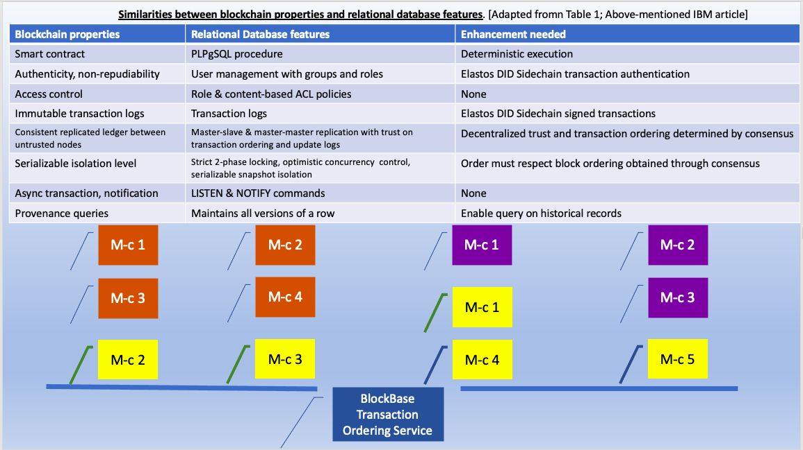

## INTRODUCTION:

# CHEIRRS
This project was based on  Lxd, Juju, Charms and Kubernetes; merged with Cyber Republic's Elastos Smartweb gRPC-based Blockchain and Database Server. Database ORM, reflection (at initialisation) and querying uses SQLAlchemy. Although there has been a major shift in the foundations of 'cheirrs', with a new discovery by us of research by IBM from 2019 which could potentially remove the need of our customers to actually invest any more than a modicum of Trust in ITOTCCA, with the concept of "Blockchain meets Database". The blockchain end of a transaction still occurs first, followed by writing or reading of data to or from Postgres, via the "etcd" (or you can use redis) cluster on the Kubernetes installation. However our intention is to follow the lead of research from IBM in India, where apparently a practical way of making a database as immutable and tamper-proof as a blockchain, has been discovered, for the purposes of Smart Contract Trading and any internetworked transactions. The paper, Blockchain Meets Database: Design and Implementation of a Blockchain Relational Database
∗
Senthil Nathan 1 , Chander Govindarajan 1 , Adarsh Saraf 1 ,
Manish Sethi 2 , and Praveen Jayachandran 1
1
1
IBM Research India, 2 IBM Industry Platforms USA
(snatara7, chandg12, adasaraf, praveen.j)@in.ibm.com, 2 manish.sethi1@ibm.com

.. refer to this link:  https://arxiv.org/pdf/1903.01919.pdf ..


has revealed that it is possible to provide Trust in a natural way in networking between Companies, whilst basically distrusting each other, by making a network of Postgres Databases behave like a large-data-capacity blockchain. To ITOTCCA, this is revolutionary. Prospective customers will no longer have to trust our company to any extent as far as daily operational security is concerned. Neither do they have to trust other companies. The idea is to allow the machines operated by each Company to keep each other honest. There is a hole in the plan, in that if globally over 50% of Ordering nodes were to be caused to act fraudulently, the factor of Trust would be destroyed. Elsewhere (on our website at itotchaincloud.com.au/security) we note the contribution of Rong Chen and Elastos in devising a hardware enhancement which is necessary for Blockchain Miners to be fitted with in order to be able to participate in Mining. This device ensures by design that no corps can act together in a gang of >50% ownership and direction. The idea is currently operational with Elastos. If a similar device were fitted to ordering servers, collusion could possibly be prevented. This requires investigation. Alternatively, it may be possible to utilise the Elastos Blockchains to provide a Fraud Check service against the database.

These developments have caused ITOTCCA to review our monolithic design, opting now for an isolation of Business Networks at the permissions level from each other and restricting the scope of connectivity to be strictly internal to each separate Business Network (of course external web-connections will still be possible, but safely shielded by whitelists under Carrier (see itotchaincloud.com.au/security). Future enterprise growth in network demand requires networks to be performance optimised and segmented (isolated) to provide access with performance. The design is now to have a range of cloud servers per Business Network, usually with one "site" per Member Class. Each member-class (represented by its own schema) would ideally take responsibility for its own virtual hardware. The virtual servers are all to be  linked between member-class nodes within a Master/Master replication system. All member-classes carry identical copies of the entire network's databases, with one strictly private Business Channel per member (company), enforced by the hardware/software in the cloud. Here, the machines are designed with the goal of ensuring clean play all the time, following the blockchain model.

However, in the above article, it is envisaged that a section of non-internetworked transactions would be outside the network. This implies that a company's own employees, and their connecting devices, can be trusted more than the internetworked transaction parties. We believe this to be highly questionable.

To this end, we are striving to implement a Hybrid model with 2 layers. We intend to offer a system which, for even the most trivial of transactions or actions, records traces on the Elastos Blockchains, an immutable source of Truth which also provides a Distributed Identity Blockchain (DID Sidechain). This will mesh with the Postgres 'DataChain' (or 'BlockBase') to provide indisputable Identification of players across the entire system. Elastos is a Global Network Operating System with permissioned Blockchains. Naturally the bulk Corporate Data will belong on the new databases, but there is a role to be played by the  flexibility and mobility of the Elastos system, especially when we consider the strengths of Elastos Essentials and dApps, Carrier's security and the DID Sidechain together. So we still intend to utilise the Elastos-Smartweb-Service github repo and docker image to play the role of joining the DataChains systems to the Blockchains systems, by acting as a very smart webserver and database server and blockchain server; all at once.

gRPC protocols replace the older style REST APIs, for communicating requests, and data inputs, from the client, and responses from the blockchain &/or database back to the client; all this occurs through the smart-web server, employing a "microservices" architecture. Here the gRPC protocols are implemented in Python. The smart-web server has Carrier installed onboard, guaranteeing security. Carrier is also installed via plugin on the Ionic dApp clients (which are developed hierarchically inside Elastos.Essentials) as well as manually on the IoT Edge client/servers (running 'node-red').

To tackle the full set of Kubernetes installations locally, ideally you would need (for 3 multipass vm's with a juju 'kubernetes-core' installation on each) a 64 GB RAM (minimum); 16 core cpu; 250 GB SSD; + HDD: PC (x86_64). eg an Extreme Gaming Computer. If you intend to include Machine Learning/AI capabilities, you really need an Accelerator NVIDIA GPU of at least 10GB vRAM. This allows approximately one ordering service and two member classes to develop with. However the most powerful way to develop here is to use Docker (see below). The current state of our Infrastructure can be represented figuratively:


The following figure represents any of the 'master-x' controllers with their 'werk-x' models, as opposed to 'lernenmaschine', the other model, on 'kubefluss' controller (based on microk8s). We install the Kubeflow (kubefluss/lernenmaschine) model first. We are still working on the design of the Transaction Ordering Service.

We base initial development such as this locally. It's cheaper!


The schema above are labeled G(n,m) for the internetworked, multiple member class dApps. In reality there is one schema/member-class (m-c: see https://itotchaincloud.com.au/the-general), across all business subnets. The single member classes, ie non-internetworked dApps (F(i)), are likewise constituted of all members of a network or dApp subscribers' group, on their own single-member-class schema. Although this is the case with the set F(i), within a single network ie schema ie dApp (in the F(i) case), we will be able to use the field for a member's id to distinguish between members' different dApp requirements and proliferate different (custom) tables and processes within a single network/dApp/schema. While the same is ideally the case for the G(n,m) set, such individual member Tables and dApps being theoretically possible, the design and coding would be expensive. Thus, by following the IBM research lead, we can say there would be one copy of the above installation per member-class, and arranged, configured and coded to ensure these databases interact as Masters in a data-intensive Blockchain-type assemblage. Therefore possibly as many as 3 for cheirrs, chubba morris and convey-it, plus as many of the internetworked member classes as existed on their own Business Subnets alongside other member-classes from other Business Subnets. eg 
member-class(n,m) with n == business sub-network id and m == member-class id. Within member classes there may be many (or few) actual independent members (Companies).

# BlockBases or DataChains

At the virtual server level, there will be one virtual Master copy of a database-and-server per member class, with the network extending across all private business subnets. This means that all signed-up Business Networks actually constitute sub-Networks of the entire system, where member-classes constitute 2nd level sub-networks, in their own combined Business Level network, ie subnets as network members of ITOTCCA's overall network including all signed up Business Networks. Please refer to the following figures.





The Internet of Things (IoT) system revolves around the IoT node-red servers on the Edge Client/Servers, being in communication with node-red server residing in the cloud and communicating via gRPC protocol buffers with separate Smart-Web server. The smart-web server receives notifications from the node-red server and passes on relevant IoT events to both blockchains and database, also communicating with the IoT Admin dApp.

This system also has the capacity for the Smart-Web server to intercept orders (for example) requiring Operational Technology Domain events to occur (eg manufacturing) and to send an order summary as a python dictionary-styled object in text to the Node-Red server using node.js. The text is converted to a JavaScript object and operated-on by Node-Red, penetrating into the OT domain safely (possibly involving the Ctrl-X movement automation platform).

The actual "Things" generating messages and signals are connected at the sites by raspberry-pi "edge" clients or similar (eg one of Canonical's Partners offers "Industrial Pi" with Ubuntu Certification, ready for the Ubuntu "Core" reduced-footprint Operating System). The administration of the IoT system occurs on the IoT dApps, connected by node-red as well as python-grpc to the server(s) and by the IOTA onboard client to the "Tangle" for event validation (as for the node-red cloud  server and the edge server). The IoT Admin dApp can be split effectively to allow networks to be under your own control and respomsibility. Both notification and actuation are possible, however with actuation, the response time of the system needs to be considered, as a cloud based server may not satisfy the sub-millisecond requirements of some machinery. Edge-based servers would need to handle such operations. The systems such as this are communicating Notifications to the Smart-Web Servers for database and blockchain recording purposes and to allow IoT Administrators to act as appropriate. Also the SmarWeb server will be able to direct an Enterprise Data Item received which requires IoT (Operationaal Technology) actuation (eg a Sales Order for manufacturing) to the Node-Red server to be introduced into a production line. Flexible manufacturing. That is, any electronic control required is provided either by the IoT devices themselves, or via components like Industrial Pi servers, locally, for groups of devices, but some types of initiation can occur through the Enterprise IT system. All communications are shielded securely on networks by Elastos Carrier, requiring the Carrier-Native and its Nodejs and Cordova "wrapper" packages to allow node.js and typescript apps to access Carrier.

ITOTCCA chooses to implement the industrial version "node-red-industrial" of node-red. Both these packages enable the visual programming of connections between IoT devices, edge client/servers and the main IoT server in the cloud, including the specification of node.js functions and system calls to be generated upon events, all varietiies of networked intercommunications, ordering of connections, etc. The main differences between node-red and node-red-industrial are concerned with Industry 4.0 readiness, with the industrial version implementing such features as an interface for Bosch-Rexroth's ctrl-X automation-of-movement Operational Technology system, for factories of the future. 

Usually IoT notifications are dealt with on a "Report-by-Exception" basis, at the cloud level, however a continuous set of signals is often required at the edge level, to maintain control. 

The technology of the fee-free IOTA "Trust Layer", being developed for IoT, is already at version 2.0 and has plans to implement Smart Contracts (presumably fee-less also). ITCSA is incorporating IOTA as our provided Trust Layer of choice for IoT operations. IOTA adds a layer of reference against which all IoT actions can be validated. The absence of fees is made possible by having each transaction validate 2 others before completion. In this way there is no "Mining" involved, as such. IOTA is designed to support Industry 4.0 Standards, and is currently popular in Europe (due to the German-originated Industrie 4.0 standards, with IOTA's headquarters in Berlin. Language translation is natively provided in German, French and Italian). The IOTA response  cycle-time is measured in seconds.

We utilise one "oseer" schema per member-class, so there is one schema for each of the n x m member-classes across all sub-networks, and one for each of the F(i) non-internetworked future dApps, as well as one for each of the A, B and C dApps (Community Housing, RealEstate and convey-IT, respectively). Our schema called 'das_fuhrwerk' is the Head Overseeing Schema, for top level customer on-boarding, usage tracking and payments, to "oversee the overseers" and to provide our own company's Enterprise dApp for our accounting, planning and administration purposes.

You need to develop initially on docker. ITOTCCA uses Ubuntu 22.04 as the host platform, with Python 3.8. DO NOT TRY TO USE PYTHON 3.10 (as is default on JammyJellyfish Ubuntu 22.04) for THE Elastos components of development on Docker.
You will not need an Extreme Gaming level of computer for Docker-based (initial - eg. database) work without Kubernetes. We have a 26 schema system taking about 16GB of RAM and not stressing the cpu at all.

See our website at https://www.itotchaincloud.com.au/kubernetes-yaml-file-example/ for an older but more visual idea of this project and others.

The Front End dApp (Ionic only version) corresponding to this ("cheirrs") project is at https://github.com/john-itcsolutions/au.com.itcsolutions.cheirrs.0.01. It uses the Ionic Platform for web app (in our cases, "distributed app") development. However the Ionic system must be used in conjunction with the newly developing 'Elastos Essentials' package. This package will include all necessary interfaces for the Elastos Ecosystem from the points of view of both developers and users. You can follow this development process (expected to introduce the first stable distribution around July, 2021) at:

https://github.com/elastos/Elastos.Essentials

Note that you may develop entirely on and for desktop computers with Ionic to get to a stage ready for deployment, however to make that dApp work with Elastos you would be required to employ the Elastos.Essentials utilities to connect to the required systems. If you develop also for mobile devices you need to upload the Essentials ".apk" file for Android and obtain various DID's and keys to securely connect on (for example) a USB-connected real mobile device using the Android Studio's "adb" tool. Aside from Android, iOS systems are currently being developed by Elastos for Essentials.

There is, additionally, a template dApp Front-End gui at https://github.com/john-itcsolutions/a-general to match the needs of an internetworked company in a supply chain or other system.

You would also require some dev tools and the openjdk for Java, as well as nodejs@14.x:

# Base requirements 
`sudo apt -y install openjdk-11-jdk build-essential curl dirmngr apt-transport-https lsb-release ca-certificates git`
     
# Install NodeJS 14
     
`sudo apt update`
     
`curl -sL https://deb.nodesource.com/setup_14.x | sudo bash -`
     
`cat /etc/apt/sources.list.d/nodesource.list`
     
`sudo apt -y install nodejs`
     
     Check version:
     
`node  -v`


As well as installing Ionic & Cordova (which enables single-pass coding for iOS and Android as well as desktop - ie browser - platforms):

`sudo npm i -g @ionic/cli`

`sudo npm i -g cordova`

The Ionic docs are at:

https://ionicframework.com/docs

In an Ionic dApp (either React or Angular-based) you will find `manifest.json`.

This file is where you can whitelist websites (including the cloud database/blockchains and server site, even if local).

All websites are blacklisted by default, until you whitelist the sites required by your dApp.

This enables the Elastos Carrier system to do its magic and connect in a private and ultra-secure way to websites, with no websockets used.

(see the Elastos Whitepaper at https://www.elastos.org/downloads/elastos_whitepaper_en.pdf)

Currently (July 2021) the Elastos Developer Documentation does not address development with the new Elastos Essentials.

Our dApp Front End (Ionic-alone version) looks like this at the current stage of development:


In order to progress to a version of our dApp (at au.com.itcsolutions.cheirrs.0.01) that can provide connection to the Elastos DID, Hive and other systems, we have had to carefully insert that repo's files into a copy of the Elastos.Essentials repo locally (at Elastos.Essentials/App/src/). There are some files (such as src/app/app-routing.module.ts) which need to be merged very carefully. We also added a "pages" directory in src/app/ and copied all our hundreds of developed pages there. There is still work to be done in this area, but note that as we do not own the Elastos.Essentials wrapper app we are unable to host our own merged code on any git repo. This development seems to have to be completed entirely locally. 

A selective approach must be taken when considering whether files should be copied as-is or not copied or merged with existing files at a finer-grained level. The benefits are that a secure and fully authenticated environment is gained for an otherwise straightforward Ionic App, where consumers/clients own their data in a hybrid web 2.0/web 3.0 arrangement. The web 2.0 part refers to the necessary centralised database in the cloud on Kubernetes, and the web 3.0 part refers to the blockchains and general Elastos connectivities. There are risks to our clients due to the necessity of using a centralised database. This "web 2.0" side of the arrangement is not as secure as a Blockchain. We cannot physically store all enterprise data on chains. They become choked. This means we require a tight plan to ensure the security of our databases from fraud and other tampering. Reference to https://itcsolutions.com.au/security should ease potential clients' minds. Vigilance is the answer to this problem.

## ________________________________________________________________________________________________________________________

## If doing initial work, where, for example, database development is involved, consider getting:

Docker for Ubuntu: https://docs.docker.com/engine/install/ubuntu/  - SAFEST WAY!

Remember to

`sudo usermod -aG docker $USER && newgrp docker`

after install is complete.

You will also require docker-compose

`sudo apt install docker-compose`

The docker-based development on this project is adapted from the code in:

https://github.com/cyber-republic/elastos-smartweb-service  (smartweb-server, providing blockchain access, containerised by ITCSA)

and

https://github.com/cyber-republic/python-grpc-adenine  (smartweb-client, database query client with Python)

and

lxd, juju, kubernetes and Kubeflow. Also:

https://jaas.ai/u/stub/postgresql (PostgreSQL without PostGIS initially)

We rely on the "etcd" cluster of the kubernetes charmed ecosystem to provide the in-memory, "key-value" query cache servers for the database transactions,
however you can use the "redis" bundle (see below).

TensorFlow by Google. 

The predominant language used to code for this project is Python (here, mainly version 3.8). The Front End dApp is in typescript, a version of javascript. On the full-fledged Kubernetes version, the IoT system ("node-red") is written in node.js, a server-compataible version of javascript, both for edge and server machines. Both the Front End dApp and the IoT system communicate with the smart-web blockchain-and-database server using the python gRPC protocol buffers, which can be found in the python-grpc-adenine github repo by cyber-republic (https://github.com/cyber-republic/python-grpc-adenine). All communications between sites and servers are protected by the Elastos 'Carrier" ultra-security system.

##  DOCKER-BASED DEVELOPMENT (Using pgadmin4_container to bind to postgis_container with database development & administration on localhost:5050)

Proceed as follows:

Get Docker and Docker-compose (see above). Pull 2 container images:

`docker pull dpage/pgadmin4`

`docker pull postgis/postgis`

create one home folder for each of your "member_class_x" projects `mkdir path/to/my-project-x && cd path/to/my-project-x`

Make a set of files all called docker-compose.yml in each my-project-x folder:

`nano docker-compose.yml`

Insert the following text, varying "x" and the names in each folder:
```
version: '3.3'
networks:
  static-network:
    ipam:
      config:
        - subnet: 172.20.0.0/16

services:
  pgadmin:
    container_name: pgadmin4_container
    image: dpage/pgadmin4
    restart: always
    networks:
      static-network:
        ipv4_address: 172.20.128.3
    environment:
      PGADMIN_DEFAULT_EMAIL: you@example.com
      PGADMIN_DEFAULT_PASSWORD: your_password
    ports:
      - "5050:80"
      
  db-0_0:
    container_name: member_class_0_0
    image: postgis/postgis
    command: postgres -c wal_level=logical -c max_worker_processes=35 -c max_logical_replication_workers=35 -c max_wal_senders=45 -c max_replication_slots=35
    restart: always
    environment:
      - POSTGRES_USER=postgres
      - POSTGRES_PASSWORD=your_password
      - APP_DB_USER=gmu
      - APP_DB_PASS=gmu
      - APP_DB_NAME=lagerhaus
    networks:
      static-network:
        ipv4_address: 172.20.128.43
    volumes:
      - ./data_46:/var/lib/postgresql/data2
    ports:
      - "5473:5432"

```

There also needs to be a set of ordering nodes (one for each member-class schema) set out as follows:

```
  db-order-0_0:
    container_name: order_member_class_0_0
    image: postgis/postgis
    command: postgres -c wal_level=replica
    restart: always
    environment:
      - POSTGRES_USER=postgres
      - POSTGRES_PASSWORD=your_password
      - APP_DB_USER=gmu
      - APP_DB_PASS=gmu
      - APP_DB_NAME=lagerhaus
    networks:
      static-network:
        ipv4_address: 172.20.128.51
    volumes:
      - ./data_54:/var/lib/postgresql/data2
    ports:
      - "5481:5432"
```

These containers need to be run in turn by entering the all-sub-projects parent folder and always including the pgadmin4 container but altering the db and db-order containers copied and pasted from their sub-project folders (dummy docker-compose.yml files) one at a time in separate terminals (all located at the sub-projects' parent directory (where all "docker-compose up" commands are run) to enable multi-threading.

Before running the elastos run script you would usually need to restore the schemata you have in the form of 
schema-backups (safest in .sql format). Consistent with following text, we show how our company has developed 
2 simple scripts to restore the entire database (including all schemata) at once. This assumes you have developed
at least some of your own schemata already. As noted below we do not release our actual schema backups.

Nevertheless as a model of how to proceed, you will require 2 shell scripts following these patterns:

In root directory of each project;

`nano docker_dbase_resetup.sh`

Insert the following content, follow the pattern,  and adapt as required to your own db and schema names. Create a folder "essentials" and copy the script there. Inside that folder

```
#!/bin/bash

# docker_dbase_resetup.sh script

createuser gmu && createdb lagerhaus && psql lagerhaus < das_fuhrwerk_backup.sql && echo "das_fuhrwerk" && psql lagerhaus < das_fuhrwerk_oseer.sql && echo "das_fuhrwerk_oseer" && psql lagerhaus < cheirrs_backup.sql && echo "cheirrs" && psql lagerhaus < cheirrs_oseer_backup.sql && echo "cheirrs_oseer" && psql lagerhaus < chubba_morris_backup.sql && echo "chubba_morris" && psql lagerhaus < chubba_morris_oseer_backup.sql && echo "chubba_morris_oseer" && psql lagerhaus < convey_it_backup.sql && echo "convey_it" && psql lagerhaus < convey_it_oseer_backup.sql && echo "convey_it_oseer" && psql lagerhaus < iot_backup.sql && echo "iot" && psql lagerhaus < member_class_0_0_backup.sql && echo "member_class_0_0" && psql lagerhaus < member_class_0_0_oseer_backup.sql && echo "member_class_0_0_oseer" && psql lagerhaus < member_class_0_1_backup.sql && echo "member_class_0_1" && psql lagerhaus < member_class_0_1_oseer_backup.sql && echo "member_class_0_1_oseer" && psql lagerhaus < member_class_0_2_backup.sql && echo "member_class_0_2" && psql lagerhaus < member_class_0_2_oseer_backup.sql && echo "member_class_0_2_oseer" && psql lagerhaus < member_class_1_0_backup.sql && echo "member_class_1_0" && psql lagerhaus < member_class_1_0_oseer_backup.sql && echo "member_class_1_0_oseer" && psql lagerhaus < member_class_1_1_backup.sql && echo "member_class_1_1" && psql lagerhaus < member_class_1_1_oseer_backup.sql && echo "member_class_1_1_oseer" && psql lagerhaus < member_class_1_2_backup.sql && echo "member_class_1_2" && psql lagerhaus < member_class_1_2_oseer_backup.sql && echo "member_class_1_2_oseer" && psql lagerhaus < member_class_1_3_backup.sql && echo "member_class_1_3" && psql lagerhaus < member_class_1_3_oseer_backup.sql && echo "member_class_1_3_oseer" && psql lagerhaus < member_class_1_4_backup.sql && echo "member_class_1_4" && psql lagerhaus < member_class_1_4_oseer_backup.sql && echo "member_class_1_4_oseer" && psql lagerhaus < iot_backup.sql && echo "iot" && echo "iot and thus FINISHED main section!" && psql lagerhaus < geordnet_cheirrs.sql && psql lagerhaus < geordnet_cheirrs_oseer.sql && psql lagerhaus < geordnet_chubba_morris.sql && psql lagerhaus < geordnet_chubba_morris_oseer.sql && psql lagerhaus < geordnet_convey_it.sql && psql lagerhaus < geordnet_convey_it_oseer.sql && psql lagerhaus < geordnet_das_fuhrwerk.sql && psql lagerhaus < geordnet_das_fuhrwerk_oseer.sql && psql lagerhaus < geordnet_iot.sql && psql lagerhaus < geordnet_0_0.sql && psql lagerhaus < geordnet_0_0_oseer.sql && psql lagerhaus < geordnet_0_1.sql && psql lagerhaus < geordnet_0_1_oseer.sql && psql lagerhaus < geordnet_0_2.sql && psql lagerhaus < geordnet_0_2_oseer.sql && psql lagerhaus < geordnet_1_0.sql && psql lagerhaus < geordnet_1_0_oseer.sql && psql lagerhaus < geordnet_1_1.sql && psql lagerhaus < geordnet_1_1_oseer.sql && psql lagerhaus < geordnet_1_2.sql && psql lagerhaus < geordnet_1_2_oseer.sql && psql lagerhaus < geordnet_1_3.sql && psql lagerhaus < geordnet_1_3_oseer.sql && psql lagerhaus < geordnet_1_4.sql && psql lagerhaus < geordnet_1_4_oseer.sql && echo "DONE!"

```

Now create a follow-up script in the same directory

`nano docker_dbase_setup_1.sh`

Insert the following text and replace with your own container & db_name, and note the final 2 sql scripts adress elastos requirements):

```
#!/bin/bash

# docker_dbase_setup_1.sh

psql lagerhaus -c '\i create_table_scripts.sql' && psql lagerhaus -c '\i insert_rows_scripts.sql'
```

In the essentials folder you require a full set of your own schemata sql backup files.

Next create a "geordnet" folder next to "essentials".

Then add the following set of files (in correspondence with the schemata in "essentials" but prefixed with "geordnet_" as a set of names. A typical PostgreSQL backup of a geordnet file is as follows:

```
--
-- PostgreSQL database dump
--

-- Dumped from database version 13.5 (Debian 13.5-1.pgdg110+1)
-- Dumped by pg_dump version 13.5 (Debian 13.5-1.pgdg110+1)

SET statement_timeout = 0;
SET lock_timeout = 0;
SET idle_in_transaction_session_timeout = 0;
SET client_encoding = 'UTF8';
SET standard_conforming_strings = on;
SELECT pg_catalog.set_config('search_path', '', false);
SET check_function_bodies = false;
SET xmloption = content;
SET client_min_messages = warning;
SET row_security = off;

--
-- Name: geordnet_member_class_0_0; Type: SCHEMA; Schema: -; Owner: postgres
--

CREATE SCHEMA geordnet_member_class_0_0;


ALTER SCHEMA geordnet_member_class_0_0 OWNER TO postgres;

SET default_tablespace = '';

SET default_table_access_method = heap;

--
-- Name: blocks; Type: TABLE; Schema: geordnet_member_class_0_0; Owner: postgres
--

CREATE TABLE geordnet_member_class_0_0.blocks (
    id bigint NOT NULL,
    tx_set json NOT NULL,
    consensus_metadata json NOT NULL,
    prev_block_hash character varying(256) NOT NULL,
    curr_block_hash_a_b_c_d character varying(256) NOT NULL,
    sig_on_hash_curr_block_by_order_node character varying(256) NOT NULL
);


ALTER TABLE geordnet_member_class_0_0.blocks OWNER TO postgres;

--
-- Name: transactions; Type: TABLE; Schema: geordnet_member_class_0_0; Owner: postgres
--

CREATE TABLE geordnet_member_class_0_0.transactions (
    client_uname character varying(128) NOT NULL,
    proc_and_args json NOT NULL,
    block_id bigint NOT NULL,
    hash_a_b_c character varying(256) NOT NULL,
    sig_a_b_c_d_client_priv_key character varying(256) NOT NULL
);


ALTER TABLE geordnet_member_class_0_0.transactions OWNER TO postgres;

--
-- Data for Name: blocks; Type: TABLE DATA; Schema: geordnet_member_class_0_0; Owner: postgres
--

COPY geordnet_member_class_0_0.blocks (id, tx_set, consensus_metadata, prev_block_hash, curr_block_hash_a_b_c_d, sig_on_hash_curr_block_by_order_node) FROM stdin;
\.


--
-- Data for Name: transactions; Type: TABLE DATA; Schema: geordnet_member_class_0_0; Owner: postgres
--

COPY geordnet_member_class_0_0.transactions (client_uname, proc_and_args, block_id, hash_a_b_c, sig_a_b_c_d_client_priv_key) FROM stdin;
\.


--
-- Name: blocks blocks_pkey; Type: CONSTRAINT; Schema: geordnet_member_class_0_0; Owner: postgres
--

ALTER TABLE ONLY geordnet_member_class_0_0.blocks
    ADD CONSTRAINT blocks_pkey PRIMARY KEY (id);


--
-- Name: transactions transactions_pkey; Type: CONSTRAINT; Schema: geordnet_member_class_0_0; Owner: postgres
--

ALTER TABLE ONLY geordnet_member_class_0_0.transactions
    ADD CONSTRAINT transactions_pkey PRIMARY KEY (hash_a_b_c);


--
-- PostgreSQL database dump complete
--

```

These files should be created by editing and replacing the schema name repeatedly, then "saving as".

There should be, au fin du jour, as many geordnet_x_y.sql files as exist in the essentials folder, but residing in the "geordnet" folder.

Each corresponding geordnet schema is associated with its own main database schema as a part of the transaction ordering system.

You need a copy of any one of the docker-compose.yml files to reside like an anchor in the parent directory of all your project folders. The name of the parent directory gives the overall network a name so every database copy can see each other one. You will be running your "docker-compose up" commands from this directory, but you need to copy and paste the section as follows from each project directory's docker-compose.yml into the parent folder's docker-compose.yml file - the copied section goes OVER the existing db code every time, as you roll out the containers, each one in a new terminal. NOTE 1: You must retain the static network and pgadmin4 sections in each "docker-compose up" invocation. NOTE 2: You will be required to paste the following into these terminals to allow non-root access:

`sudo usermod -aG docker $USER && newgrp docker`

In the end, this procedure gives a multi-threaded set of containers all connected to pg-admin4:

```
db-0_0:
    container_name: member_class_0_0
    image: postgis/postgis
    command: postgres -c wal_level=logical -c max_worker_processes=35 -c max_logical_replication_workers=35 -c max_wal_senders=45 -c max_replication_slots=35
    restart: always
    environment:
      - POSTGRES_USER=postgres
      - POSTGRES_PASSWORD=your_password
      - APP_DB_USER=gmu
      - APP_DB_PASS=gmu
      - APP_DB_NAME=lagerhaus
    networks:
      static-network:
        ipv4_address: 172.20.128.43
    volumes:
      - ./data_46:/var/lib/postgresql/data2
    ports:
      - "5473:5432"

```
 fresh each time you start a member_class's server (so the ipv4 address and port number change as well as the name of the container you are running).

The ordering nodes require a different docker-compose fragment (from above):

```
  db-order-0_0:
    container_name: order_member_class_0_0
    image: postgis/postgis
    command: postgres -c wal_level=replica
    restart: always
    environment:
      - POSTGRES_USER=postgres
      - POSTGRES_PASSWORD=your_password
      - APP_DB_USER=gmu
      - APP_DB_PASS=gmu
      - APP_DB_NAME=lagerhaus
    networks:
      static-network:
        ipv4_address: 172.20.128.51
    volumes:
      - ./data_54:/var/lib/postgresql/data2
    ports:
      - "5481:5432"
```

Now we have a running database on each port 54xy but if you go to localhost:5050 (pg-admin4) each database server will be on 5432 since pg-admin works with in-container ports. To see each database we need to register a server for each member_class database copy, making the name of the server correspond to the directory name of each member-class. Insert ip address (but always use port 54xy:5432 here, varying x and y uniquely) from the appropriate docker-compose.yml. 

So, in the parent folder of "essentials" compress the folder with:

`tar zcvf essentials.tar.gz ./essentials`

Then "docker cp" essentials.tar.gz to every db container .

Inside each container - 

`docker exec -it container_name bash`

- then

`mkdir postgres && chown postgres postgres && mv *.tar.gz postgres/ && su postgres`

and

`cd postgres`

Untar the file and run the script(s) - 2 scripts in "essentials". This will restore the lagerhaus database in the appropriate containers.

And wait until complete.

Then:

After all database copies are up and running, you can set about coding "Logical Replication" on all servers. Basically each server is required to publish all tables and each server requires a set of subscriptions covering all other servers. The ordering nodes require a subscription to their own Member Class servers, in correspondence.

So, in each non-ordering server proceed as follows.

`docker exec -it postgis_container_x_y bash`

`su postgres`

`psql lagerhaus`

`CREATE PUBLICATION member_class_x_publication FOR ALL TABLES;`

Ending with a full set of servers with Publications of ALL TABLES.

You can also complete this directly in PgAdmin4.

And then subscribe every non-ordering server to every other non-ordering server's Publications with (eg):

`CREATE SUBSCRIPTION member_class_x_member_class_y_subscription CONNECTION 'host=172.20.128.x port=5432 dbname=lagerhaus password=your??postgres??password' PUBLICATION member_class_x_publication;`

Each ordering node must be subscribed to its own Member Class server Publication.

Thus Logical Replication is implemented.

The next step is to investigate how to involve the Ordering Service in the ordering of transactions by consensus from the other servers, and propogating the finalised Blocks throughout the system. We require a partitioned set of Order_Member_Class_x servers including on the database "lagerhaus".


The above code needs to be copied (as for the previous set) to the overall parent Project Directory, but only over the "services \ db-z: .. etc" section, in the existing docker-compose.yml file, leaving the first (network definition) section and pg-admin4 sections intact so as to preserve the pgadmin4 and static network settings. When the databases from this "partition" are rolled out they will have a structure of schemata, tables and columns identical, and the ordering nodes have a much simpler set of 2 tables per server ("Transactions" & "Blocks"), (identical) in each schema. eg of one schema in "geordnet_member_class_z" schema is "geordnet_member_class_w" with 2 tables (same for each table in each schema), 1. transactions, and 2. blocks. Transactions has a. username of client b. procedure executed and arguments (json) c. block_id d. Unique identifier == hash (a, b, c) e. Signature on hash(a, b, c, d) using client's private key. Block Table has a. Block-id b. set of transactions (json) c. metadata associated with the consensus protocol d.hash of the previous block e. hash of the current block, i.e., hash (a, b, c, d) f. Digital signature on the hash of the current block by the orderer node.

Our final (nearly!) Docker Installation of 50 servers linked to a pgadmin4 container looks like:


Next we have to clone the Elastos Smartweb blockchain and database server package to the Sub-Project root directories:

`git clone --recurse-submodules https://github.com/cyber-republic/elastos-smartweb-service.git`

With the development of the database enabled after we run the docker-compose file (administer and develop at 
127.0.0.1:5050 on your Host), the "run.sh" script as defined in the Elastos repo we just cloned needs to be edited.

Open elastos-smartweb-service/run.sh in an editor and comment out the top lines as shown here:

```
#!/bin/bash

# Run postgres server as a docker container
#cd tools
#./postgres.sh
#cd ..
virtualenv -p /usr/bin/python3.8 venv

source venv/bin/activate

pip install -r requirements.txt

export PYTHONPATH="$PYTHONPATH:$PWD/grpc_adenine/stubs/"

python grpc_adenine/server.py
```

so that the run.sh script does not attempt to start any "postgres" container (we are using "postgis/postgis" 
image as the postgis_container, however it will already be running when "./run.sh" is executed - see below)

Note that for postgres database development the progress is easier if you are user "postgres" on the Host.

You now need to edit the `elastos-smartweb-service/.env.example` file to reflect your own docker network addresses. The database ip-address
is found as above from 

`docker container inspect postgis_container`

The container ip-address should be inserted in env.example together with the Gateway address (found in `docker container inspect postgis_container`), which should be inserted as the blockchain access addresses in the same file. Next, alter port for database to 5432 and give it your own database's name. Then save the `env.example` file as a) `.env`, and b) as `.env.test` with these edited settings.

Next we edit the `elastos-smartweb-service/grpc-adenine/database/__init__.py` file to insert the same database ip-address and your own database name.

Save all this work.

If you wish to get a sanity check on whether elastos is connected to your database after running, you can use the following to replace the 
`elastos-smartweb-service/grpc-adenine/database/__init__.py`:

```
import logging

from sqlalchemy import create_engine, MetaData
from sqlalchemy import inspect

from sqlalchemy_wrapper import SQLAlchemy
from decouple import config

# Set up logging
logging.basicConfig(
    format='%(asctime)s %(levelname)-8s %(message)s',
    level=logging.DEBUG,
    datefmt='%Y-%m-%d %H:%M:%S'
)

# Connect to the database
db_name = config('DB_NAME')
db_user = config('DB_USER')
db_password = config('DB_PASSWORD')
db_host = config('DB_HOST')
db_port = config('DB_PORT')

database_uri = f"postgresql://{db_user}:{db_password}@{db_host}:{db_port}/{db_name}"

try:
    db_engine = create_engine(database_uri)
    connection = SQLAlchemy(database_uri)
except Exception as e:
    logging.fatal(f"Error while connecting to the database: {e}")

meta = MetaData()
insp = inspect(db_engine)

schemata = insp.get_schema_names()
num_sch = len(schemata)
num_tab = 0
for schema in schemata:
	num_tab += len(insp.get_table_names(schema))
print("There are ", num_sch, " schemata")
print("There are ", num_tab, " tables")
print("These are the schema names: ", schemata)

print("Done!")

```

Finally, we are in a position to issue the command (from <project_root>/elastos-smartweb-service/):

`./run.sh`

Unlike the cases following, where we develop in Kubernetes, the database is directly accessible via a gui 
(provided by PgAdmin4) in this form of development. You must develop tables, columns, views and a foreign key 
relationship system in the database itself.

In addition, the Python-gRPC protocol buffer services must be developed on the smartweb server to provide the 
Ionic/Cordova front end gui with target procedures to call from your Ionic Typescript code (to Python-encoded protobufs) 
via Carrier and the Python-gRPC client. These procedures will do the data input and output query work for your dApp 
on Postgis. You may also need to program trigger functions in PLpgSQL on the database in order to process data. 

## Instructions on how to build and run python-grpc-adenine locally
Clone the repository
```
git clone https://github.com/cyber-republic/python-grpc-adenine.git
cd python-grpc-adenine
```
Setup virtualenv:
```
virtualenv -p `which python` venv;
source venv/bin/activate;
```
Install dependencies:
```
pip3 install -r requirements.txt;
```
Setup environment variables and update variables if needed:
```
cp .env.example .env;
```
Run sample.py:
```
python sample.py
```

Remember it is more efficient to have postgis processing data wherever possible, and not having the smartweb server doing 
more than necessary. This is one good reason to learn PLpgSQL!

Postscript: Without knowing exactly how, I managed to start a separate process on tcp 8001, labelled as a Postgres process 
which I now understand to be the still-running "old" process from the previous "docker-compose up" command. This is actually 
one of the ports reserved for the grpc smartweb server. I killed that old process with 

`sudo kill -9 $(sudo lsof -t -i:8001)`

and all was well.

Also, do not try to use the elastos-smartweb-service repo with Python3.10. Version 3.8 is required. Trust us ...


______________________________________________________________

## KUBEFLOW Preliminaries: NOTE The following remarks on installing the Nvidia and Cuda systems constitute a work in progress only:

With the exception of noting that this:

`nvidia-smi`

should produce a positive message, if you want to use your nvidia gpu with CUDA capacities as part of the system; we cannot advise further.

________________________________________________________________


## We continue by installing Kubeflow to obtain a controller compatible with this Juju/TensorFlow environment:
________________________________________________________________

   
     Note that we have actually found it impossible to sustain a kubeflow controller on the microk8s cloud at the same time as we are running 
     the second controller on the localhost cloud referred to in the text below the kubeflow Manual (ie our main Application on the 'betrieb' controller, with instructions following the Kubeflow "manual"). The host randomly reboots. There is sufficient RAM onboard our host according to the system monitor, so at this stage the
     cause is unknown. There were less crashes after installing a Mechanical HDD, but still unsatisfactory.
     
     The latter cloud running the 'betrieb' controller works alone, and, as it represents the more business-end of our business, we continue with an alternative
     kubeflow arrangement. 
     
     An isolated setup for the kubeflow/juju/microk8s cloud works better with Kubeflow installed alone on a dual boot Ubuntu/Ubuntu system with one partition
     running a juju/microk8s host for a "kubeflow" model. 
     
     The second Linux (Ext4) filesystem partition runs the localhost/lxd/juju cloud with betrieb controller and "werk" model. The werk model runs the main
     backend Kubernetes Apps within an array of 2 identical virtual multipass machines (with only 1 operating at a time, designed for redundancy during
     development).
     
_____________________________________________________________________________________
     
##   We offer the following, which has been adapted from:
     
https://discourse.ubuntu.com/t/install-kubeflow-anywhere/20207
     
     There seems to be a problem with mixing controller types on the Host.
     If the following is implemented on the Host directly, the upcoming section 
     on installing the cheirrs backend with database and blockchains, should 
     be performed on a multipass ubuntu vm on top a separate Host (we have created a second bootable partition). See above.
     For now, the following should be performed on the Host (unless you feel like arranging X11 
     port forwarding to be able to access the Kubeflow Dashboard from a vm on the Host browser). As noted, we finished
     by repartitioning the Main HDD into 2 installations - one for kubeflow (directly on Host), and
     the other for Elastos, the Blockchains and database server on an array of 2 identical multipass vm's:
     For Kubeflow:
     
`[sudo snap install multipass]`
     
`[multipass launch -n <vm-name> -c 3 -m 12G -d 100GB]`
     
     1. Install juju components
     2. Install microk8s on Host or vm as above
     3. Add yourself to the microk8s group
     4. Perform quick reset of terminal; as follows

On the Host, or a multipass vm, you'll need to install these snaps to get started:
     
     In the following, the version of juju which works is (currently - 15/03/2022):
     2.9.22. However the only version obtainable via snap is 2.9.26.
     One way of obtaining the necessary executable is to go to 
     https://launchpad.net/juju/+milestone/2.9.22
     and download a copy, then extract it and save a copy of the "juju" binary file 
     somewhere safe as well as copying the "juju" binary to /snap/bin/. Then:
     
`sudo snap install microk8s --classic --channel=1.21/stable`

Next, you will need to add yourself to the microk8s group:

`sudo usermod -aG microk8s $USER && newgrp microk8s`

`sudo su - $USER`   (quick reset of terminal)
     
     OR eqivalently:
     
`sudo usermod -aG microk8s $USER && newgrp microk8s && sudo su - $USER`
     
`mkdir ~/.kube`
     
`sudo chown -f -R $USER ~/.kube`
     
`microk8s enable dns storage ingress metallb:10.64.140.43-10.64.140.49`
     
`sudo iptables -P FORWARD ACCEPT`
     
     (Check staus)
     
`microk8s status --wait-ready`
     
     [During the following, you may need to reboot a vm (if you chose this option) 
     and find that the multipass daemon is inaccessible, and you are unable to 
     shell into the vm.
     In that case:
     
`sudo snap refresh multipass`
     
     Although the response may appear sad to you, the good reconnecting work 
     has already been done. Repeat the shell command and you should succeed.
     If not, repeat last steps.]
     
     Then:
     
`juju bootstrap microk8s [<my-controller>]`
     
`juju add-model kubeflow`  (the dashboard and other components require the model name to be "kubeflow")
     
`juju deploy kubeflow-lite --trust`  

- or full kubeflow:  

`juju deploy kubeflow --trust`
   
     (You require 4 spare cores, 16GB spare memory and 60GB disk space - minimum - for the full kubeflow.)
     
     Either of the above 2 versions of the deploy command may be simply repeated in cases of broken links, 
     i/o timeouts, etc in mid-deployment.
     
`watch -c juju status --color`  to watch progress.
     
Optional:
[

`sudo snap install kubectl`
     
`alias kubectl='microk8s kubectl'`

]     
     Dashboard auth credentials by:
     
```
     juju config dex-auth public-url=http://10.64.140.43.nip.io
     juju config oidc-gatekeeper public-url=http://10.64.140.43.nip.io
```
     
```
     juju config dex-auth static-username=admin
     juju config dex-auth static-password=<your_password>
```
     
     Dashboard IP Address [we do not cover X11 port forwarding here]:
     
`kubectl get services -n kubeflow`
     
     (look for the IP Address associated with the NAME "kubeflow dashboard")
     
Use this to locate the dash in your browser, on port 8082. ie ip-addr:8082

## NOTE: If juju loses connection to the microk8s cloud at any stage:

`juju update-k8s --client microk8s`

or, in general:

`juju update-k8s --client <cloud-name>`

and be prepared to wait quite some time.


___________________________________________________________________________________________
     
##   As another alternative:
     
     See https://chapeau.freevariable.com/2021/04/microk8s.html
     
     for a rundown which seems very reliable and well-thought-through. 
     Note the section on creating storage linked to the host machine.
     Also note that you should skip the GPU section if you do not have
     a GPU (Graphical Processor Unit - a Pluggable physical device) running.
     
________________________________________________________________________________________________

     The following image is a screenshot of the `lernenmaschine` model's status board after 
     successful installation of "kubeflow-lite":


     
____________________________________________________________________________________

## KUBEFLOW MANUAL

### Main Dashboard

Most interactions will go through the central dashboard, which is available via
Ambassador at `/`. The deploy scripts will print out the address you can point your browser to when they are done deploying.

### Pipelines

Pipelines are available either by the main dashboard, or from within notebooks
via the [fairing](https://github.com/kubeflow/fairing) library.

Note that until https://github.com/kubeflow/pipelines/issues/1654 is resolved,
you will have to attach volumes to any locations that output artifacts are
written to, see the `attach_output_volume` function in
`pipline-samples/sequential.py` for an example.

### Argo UI

You can view pipelines from the Pipeline Dashboard available on the central
dashboard, or by going to `/argo/`.

### TensorFlow Jobs

To submit a TensorFlow job to the dashboard, you can run this `kubectl`
command:

    kubectl create -n <NAMESPACE> -f path/to/job/definition.yaml

Where `<NAMESPACE>` matches the name of the Juju model that you're using,
and `path/to/job/definition.yaml` should point to a `TFJob` definition
similar to the `mnist.yaml` example [found here][mnist-example].

[mnist-example]: charms/tf-job-operator/files/mnist.yaml

### TensorFlow Serving

See https://github.com/juju-solutions/charm-tf-serving


## Removing

### Kubeflow model

To remove Kubeflow from your Kubernetes cluster, first run this command to
remove Kubeflow itself:

`juju destroy-model lernenmaschine --destroy-storage`

If you encounter errors while destroying the model, you can run this command
to force deletion:

`juju destroy-model lernenmaschine --yes --destroy-storage --force`

Alternatively, to simply release storage instead of deleting it, run with this
flag:

`juju destroy-model lernenmaschine --release-storage`

### Kubeflow controller

You can destroy the controller itself with this command:

    # For microk8s
`juju destroy-controller $(juju show-controller | head -n1 | sed 's/://g') --destroy-storage`

As a last resort (eg lost contact with API server) you can:

`juju kill-controller my-controller`

## Tests

To run the test suite included in this repository (bundle-kubeflow), start by installing the Python dependencies:

`pip install --user -r requirements.txt -r test-requirements.txt`

Next, ensure that you either have the `juju-helpers` snap package installed, or you have
the `kubectl` binary available with `~/.kube/config` set up correctly.

Then, run the tests with this command:

`pytest tests/ -m <bundle>`

where `<bundle>` is whichever bundle you have deployed, one of `full`, `lite`, or `edge`.

If you have Charmed Kubeflow deployed to a remote machine with an SSH proxy available
(for example, if you have MicroK8s running on an AWS VM), you can run the tests like this to run them against the remote machine:

`pytest tests/ -m <bundle> --proxy=localhost:9999 --url=http://10.64.140.43.xip.io/ --password=password`

Additionally, if you'd like to view the Selenium tests as they're in progress, you can
pass in the `--headful` option like this:

`pytest tests/ -m <bundle> --headful`
 ______________________________________________________________

# There is a possibility of setting up a Postgres database with PostGIS and Open Street Maps. It appears that the procedure Canonical have taken with Kubeflow above utilises MongoDB during installation, a no-SQL, non-relational database system, as one of the persistence stores as well as Mariadb (a resurrection of the opensource version of mysql) within the "kubeflow" model (which we are calling `lernenmaschine` ..)

As noted below, it is possible, using cross-model referencing, and "offers", to enable an application on a separate controller and/or model, eg the kubeflow model in the uk8s controller, (or just a separate model on the same controller) to access the PostgreSQL/PostGIS database ('haus') on the 'betrieb' controller and the 'werk' model (see following) therein.

See below at the "## Set up Cross-Model Referenced "offer" .. " heading.

But which `<application-name>` (in kubeflow model) to use as requiring connection to the provided db?

To be continued.

_________________________________________________________________

# A Second Model on a second controller:

(The database schemata for ITOTCCA's project are private and available only under certain conditions.)
     
   {  If you have implemented a kubeflow installation (above) on one partition of the Host (on a microk8s cloud/controller),
     you will need to obtain multipass to allow creation of five Ubuntu virtual machines (Kubernetes "nodes"), on this second partition (ie dual-boot Ubuntu/Ubuntu)}.
     
`sudo snap install multipass`

`multipass launch -n master-0 -c 4 -m 12GB -d 50GB`

`multipass launch -n master-1 -c 4 -m 12GB -d 50GB`

`multipass launch -n master-2 -c 4 -m 12GB -d 50GB`

     
     (You can tweak those settings)
     And end-up with 3 x LTS Ubuntu vm's which we will set up as 3 master nodes using "juju/lxd".
     
     
     Then mount a shared directory to enable access to your host:
     
     On each vm
     
`mkdir shared`

`exit`

`multipass mount path/to/your/working/directory master-<x>:~/shared/`


*******************************************************

In each vm:
	
`sudo snap install juju --classic`
	
`juju bootstrap localhost master-<x>`
	
`juju add-model werk-<x>`
	
`juju deploy kubernetes-core`
	
`juju config calico vxlan=CrossSubnet`
	
`juju config calico ignore-loose-rpf=true`
	
`juju remove-unit easyrsa/0 --force` & maybe repeat once or twice ..
	
`juju remove-machine 0/lxd/0 --force` & again 
	
`juju add-unit easyrsa`
	
`watch -c juju status --color`
	
	You should now be looking at the status board of one vm with kubernetes converging.
	When every process is complete except possibly the control-plane and/or worker 
	may be in a 'wait' state:

	
`juju deploy -n 2 postgresql pg-wodehouse`
	
`juju config pg-wodehouse admin_addresses=127.0.0.1,0.0.0.0,<ip-addr-worker-0>,<ip-addr-worker-1>[,<ip-addr-worker-2>]`
 
This completes the servers' setup.

________________________________________________________________
 
# DATABASE: Internals

You will need a set of 2 member-class schemata with another 2 overseer schemata (we use 2 - the_general, 
and the_general_oseer  and copied them 2 times, at this early stage) to serve as material for development.

In our case, if a single member-class network existed solo (such as any of our Real Estate Property dApps) we would be required 
to separate the existing single network into several (3 to provide a 'Mexican Standoff' arrangement) servers 
designed to keep everyone honest.
	
The ordering services will run alongside the main system and will have its own elastos webserver. The database is separate to the main, with 2 tables per schema - blocks and transactions (see Docker section above).	

In our case, with The General, we started the process of building the main databases from 3 schema backup .sql files,
and put all backups and scripts into a single folder, and copied '*' to postgres masters, into a folder we will now make:

`juju ssh <machine number postgres master>`

As user ubuntu:

`mkdir main && chown postgres main`

The ordering services will run alongside the "main" database, so create:

`mkdir ordering && chown postgres ordering`

`exit`

`juju scp path/to/main_backups_and_scripts/* pg-wodehouse:/home/ubuntu/main/`

A sample backup of an ordering service database is shown in the Docker section above. By editing and replacing the existing schema name you can have your own name and define a new database in pg-wodehouse entitled 'geordnet' then  prepare to restore the ordering schema within the new database with:

`nano start_geordnet`

Copy and paste this:

`createdb geordnet && psql geordnet < ordering_service_name.sql`

make sure to install both the startup script and the ordering schema backup together and:

`juju scp path/to/scripts/* pg-wodehouse:/home/ubuntu/ordering/`

Having copied the backup(s) and scripts (cheirrs/database-as-blockchain/*) to the user "ubuntu's" /home/ubuntu/main and /home/ubuntu/ordering directories in the master postgres pod, one does
	
`juju ssh <machine number postgres master>`
	
	In the postgres machine now:

`sudo passwd postgres` and enter your password twice to change existing unknown password.

`su postgres`  You are at /home/ubuntu - and your backup.sql's are there too.

`cd ordering`

`./start_geordnet`

When done;

`createuser gmu` (For Elastos' purposes.)

`createdb db_name`

`psql <db_name> < backup.sql`, and similarly for other schemata. In the final state, there will be one schema per 
member-class plus other utility schemata such as "iot" and an overseeing schema for each member class.
			     
			     
	You will also need to deal with users and passwords as well as setting allowed search paths for user 'gmu' to all schemata.

At this stage it is envisaged that we would set up one schema for each member-class in an inter-enterprise network, plus an iot 
schema and a set of oversight schemata (to run Business Process Supervision from). Also the design would 
require only one database server (though replicated) per member-class (plus one for the ordering service in a production setup) - ie one vm per member-class - 
(not "per member" as in the IBM paper). 

All pods would be situated together in the cloud (and probably replicated at a site-level globally).

If you use (or adapt) our scripts to sequentially restore your backups and set up postgis, etc, you should copy these to /home/ubuntu/main
in each database master, together with your own sql backups. 
_______________________________________________________

## Getting PostGIS and Open Street Maps
	
	As user 'ubuntu' in each vm's postgres master:

`sudo add-apt-repository ppa:ubuntugis/ppa`

	Also as 'ubuntu':
	
`./dbase_setup_2.sh`
			     
`su postgres`
			     
`./dbase_setup_3.sh`
	
This completes database setup.
	
_______________________________________________________________

# ALSO:

# Blockchains-Database Server 

     We turn to finish setting up the Blockchain/Database gRPC Server Deployment.
			     
     In each multipass vm (except in ordering service vm, as there is no need for blockchain access here)
     , in /home/ubuntu; 
			     
`juju ssh <machine number kubernetes-worker/0>`
	
`git clone --recurse-submodules https://github.com/cyber-republic/elastos-smartweb-service.git`
	
	While we're at it, on one vm in the shared folder (thus available to all vm's plus Host)
	
`git clone https://github.com/john-itcsolutions/cheirrs.git`
	
	
	
_______________________________________________________________
     

# NOTE:
	As we don't own or control the elastos sub-modules, and since the `elastos-smartweb-service/grpc_adenine/database/__init__.py` file is not fully usable as it is, in the elastos-smartweb-service module (as-cloned), we have included ITOTCCA's version of `__init__.py` in a folder in the cheirrs root directory. This version caters for initialising the SQLAlchemy interface from the existing database, and generating a full set of Database Models, using SQLAlchemy's ORM & methods of Database Metadata Reflection. However you need to edit this file carefully to suit your own database, at your
`shared/cheirrs/TO_BE_COPIED_INTO_smartweb-service/TO_elastos-smartweb-service.grpc_adenine.database/__init__.py` 
(in the shared directory on "primary" with a local clone of this repo) to enable it to work properly as a Python init file. This init file will be run by the system before running the server at /grpc_adenine/server.py. You would have to keep these 2 versions of `__init__.py` in sync with each other if you need to edit `__init__.py`, and want to use your own github account, for example.

     
The blockchain server ip-addresses in the .env, and .env.test files on each elastos pod, need to match the address of the targeted pod. Also the database details will require alteration.
     
Presuming you have obtained a fresh clone of "elastos-smartweb-service" with "recurse-submodules",  and 'cheirrs' at cloning-time, you will need to ensure the __init__.py within grpc_adenine/database directory is updated to our repo's version (as discussed above). Actually there is no need to alter the __init__.py file in the repo, rather in the cheirrs/TO*/*database/, which is where the file will be copied (soon) to the vm's.
     
     So, edit cheirrs/TO*/*database/__init__.py to insert your schema names, database name & database url.
     
You also need to treat the "run.sh" and "test.sh" (which are in cheirrs root directory also) similarly. So we will copy them soon to elastos-smartweb-service over the existing "run.sh" and "test.sh". Postgres connections in Kubernetes are not possible in the fashion assumed by "run.sh" and "test.sh" in elastos by default.

So in shared/cheirrs root "TO_BE_COPIED_TO_smartweb-service" directory are scripts and modules in .sh, .env, .env.test and .py that have had to be altered from those provided in the experimental Elastos-smartweb-service repo. These should be copied over the existing files in the target elastos pods, after editing .env and .env.test to replace existing database and pod addresses with addresses obtained from the installation. Therefore, on primary:

`cd ....path/to/shared/cheirrs`

Now perform each of the following 2 steps for each vm , paying particular attention to the .env, .env.test and __init__.py files,  where the database host address will need to be edited for each target-pod ie worker node, and similarly for the elastos pod addresses (== worker/0 addresses) on each node in .env & .env.test:
     
     1:

`juju scp shared/cheirrs/TO*/*service/* <machine numder kubernetes-worker/0>:~/elastos-smartweb-service/`

`juju scp shared/cheirrs/TO*/TO_.env_in_elastos-smartweb-service_<vm-"master-number"eg 1>/.env <machine numder kubernetes-worker/0>:~/elastos-smartweb-service/`
	

`juju scp shared/cheirrs/TO*/TO_.env_in_elastos-smartweb-service_<vm-"master-number"eg 1>/.env.test <machine numder kubernetes-worker/0>:~/elastos-smartweb-service/`
	
     2:
     
`juju scp shared/cheirrs/TO*service/TO_elastos-smartweb-service.grpc_adenine.database_<node-number-eg 1>/__init__.py <machine numder kubernetes-worker/0>:/home/ubuntu/elastos-smartweb-service/grpc_adenine/database/__init__.py`


 After you have covered the 2 master-x nodes:
 
in each:

`juju ssh <machine number kubernetes-worker/0>` 
	
`cd elastos-smartweb-service && ./run.sh`
.. and wait and watch .. and examine logs in case of errors, which are available at (TODO). 
     If all is well, you should be looking at the blockchains' log, on stdout, as the cycles roll every 30 seconds.
     
     There is also a dbase_report.txt (just a structural summary) at /home/ubuntu on each pod.


_________________________________________________________________________________________________
     
     The following is a screenshot of the status board after successful installation:
     

     
     stdout of Blockchains looks like:
     

     

_____________________________________________________________


## TESTING the smartweb-service/Blockchains/Postgresql System

     Enter kubernetes-worker-0 and:
     
     `cd el*`
     
     `./test.sh`
     
     We are having difficulties with the jwt token and key system for entry authentication to the smart-web server ..
     
To be continued ..
_____________________________________________________________
 
## In master-0 and master-1, enter kubernetes-worker-0, to set-up an IoT server with Python-gRPC, 
## node-red-industrial, Carrier and IOTA client.
     
`juju ssh <machine-number-worker-0>`

(To install nodejs and npm, needed for Node-red, the Carrier wrapper and to connect 
with gRPC as well as the IOTA node.js client:)
     
# Install NodeJS 14
     
`sudo apt update`
     
`curl -sL https://deb.nodesource.com/setup_14.x | sudo bash -`
     
`cat /etc/apt/sources.list.d/nodesource.list`
     
`sudo apt -y install nodejs`
     
     Check version:
     
`node  -v`
     
     To get Node-Red-Industrial:
     
`sudo snap install node-red-industrial`
     
             on the Host (acting as an Edge server)
     
Also, in worker-0 (`juju ssh machine-number-worker-0`),
     
`sudo snap install node-red-industrial`
     
     and go to your own host's LAN address, on a new tab in the 
     browser, with port `1891`,
     then, in worker-0, 
     
     from the home directory, and go to your worker-1's address with port 1891
     in a browser tab on your Host. If using multipass you may need to use the URL of 

`0.0.0.0:1891` 
     
     to obtain access to the multipass>juju>[worker-0] vm. 
     
    These 2 pages can interact, and generate and forward messages, events and commands.
     
     Eventually the idea is to be able to "log" and respond (in appropriate timeframes
     corresponding to the message origin and content) to events considered as "exceptional"
     in some way. The events and messages (originating on iot devices connected to "edge" 
     raspberry-pi (or Industrial Pi) units or similar, in the field) will be logged on the IOTA 
     Tangle and your database, via javascript functions in node-red wrapped in Carrier and 
     using the gRPC protocols on worker-0, to the "smart-web" server.
     
     As noted elsewhere, the required response times of some machinery and systems means 
     sub-millisecond cycles, which cannot be achieved without dedicated Edge-client/server 
     support geographically close to sites, when actuation is involved. Otherwise, 
     notification functions can be handled directly to the Cloud. 
     
     Follow the README.md instructions on the repo site to build the client.
     
     Similarly we need to allow (Elastos) Carrier-shielded communication between "edge" (here, Host),
     and worker-0. For this, on both Edge (Host here) and worker-0, we require the Carrier Native SDK and to follow this by installing the 
     Carrier Nodejs Wrapper package. This would need to also occur on Real-World Edge Clients running node-red-industrial.
     
     https://github.com/elastos/Elastos.NET.Carrier.Nodejs.SDK and 
     https://github.com/elastos/Elastos.NET.Carrier.Native.SDK have details.
  
     
     The installation of IOTA client proceeds as follows (repeat for Host - ie Edge):
     
     In worker-0, master-0 & master-1:
     
`mkdir iota && cd iota`
     
`npm init`  (accepting all defaults will do)
     
`npm install @iota/core @iota/converter @iota/client`
     
     Add a file called `index.js` with the following content:
     
```
     async function run() {
     const {
     ClientBuilder
     } = require('@iota/client');
    // client connects to a node that has MQTT enabled
     const client = new ClientBuilder()
     .node('https://api.lb-0.h.chrysalis-devnet.iota.cafe/')
     .build();
     client.subscriber().topics(['milestones/confirmed', 'messages', 'messages/referenced']).subscribe((err, data) => {
     console.log(data);        // To get the message id from messages `client.getMessageId(data.payload)` can be used
     })
    await new Promise(resolve => setTimeout(resolve, 1500));    // unsubscribe from 'messages' topic, 
     //will continue to receive events for 'milestones/confirmed', etc
     client.subscriber().topics(['messages']).unsubscribe((err, data) => {
     console.log(data);
     })
     }
run()
```
     
The approach we have taken here is to rely on Message exchanges on MQTT 
for validation of IoT actions and events.
     Please refer to https://client-lib.docs.iota.org/docs/libraries/nodejs/examples 
     for a full explanation of all topics to which an application may subscribe on IOTA. 
     
     The launch of the client, on both Edge (Host) and worker-0, occurs with:
     
`node index`   from the iota root directory.
     
     By choosing the node.js version of the IOTA client, we get the ability to easily communicate with the other 
     apps on the worker-0 vm, and on the Edge server (Host here).
     
     A typical node-red site appears as follows (all clients - eg raspberry-pi edge clients - 
     as well as the server can show pages similar to this). Here is shown the "Edge" site page mimicked by 
     the Host, ideally enclosed in Carrier (however the Nodejs wrapper, needed to access Native Carrier, appears to be
     not working, or we are not setting it up correctly :-)).
     

     
     To match this, a server might look like:
     

     
     It is easy to see in the first shot (of Edge client) the increased processing necessary when an actuation 
     is to be controlled from the server via the edge client, ie. in "second_fleet".
     
## Obtain and install Carrier and the Carrier Nodejs Wrapper:
     
     On Edge clients:
     
`git clone https://github.com/elastos/Elastos.NET.Carrier.Native.SDK.git`
     
     Follow instructions on the repo to compile and install.
     
`git clone https://github.com/elastos/Elastos.NET.Carrier.Nodejs.SDK.git`
     
     Run:
     
$ cd $(SRC_ROOT)
$ git clone --branch v9.10.0 https://github.com/nodejs/node.git
$ cd node
$ ./configure
$ make
$ make install
     
     Follow instructions on repo from here.

     
     NOTE: We have not yet succeeded in installing the Nodejs Wrapper.

_________________________________________________________________________________________________________________________________________
     
     
 ## SUMMARY:
     
     At this point we have a handful of problems preventing the werk model from functioning with a 
     kubeflow model without resorting to multipass (which worked poorly). The fundamental problem is 
     that the 2 installations require different types of controllers. We chose to partition the main 
     drive and place kubeflow on one bootable partition with the juju/lxd/kubernetes system on the second.
     	for the Elastos/Node-Red/IOTA/PostgreSQL+GIS model:
     
     1.  Complete MAAS setup to allow desktop hosting of two controllers thus allowing our (TensorFlow) 
         'lernenmaschine' model to be implemented alongside 'werk'
     2.  We have a minor problem involving shaping Australian Address data for our requirements
     3.  The generation of an acceptable JWT token to authenticate to SmartWeb
     4.  Get the Nodejs Wrapper package for Carrier working properly
     5.  Follow the IBM article above to implement the various points outlined in the paper, in code.
     6.  Do everything necessary to make a Postgres Database become "like a Blockchain".
     	   -  Understand how to make the Ordering Service function, in particular investigate Serialisable 
	   Snapshot Isolation and the methods for obtaining Consensus. 
     7.  Continue to use the Elastos Blockchain systems for dApps at front end and to provide several useful services,
	 including Distributed Id's (DID Sidechain), Carrier Security and more.
     8.  Learn how to provide authentication from Elastos DID Sidechain to Postgres DataChain/BlockBase system.
     
 _________________________________________________________________________________________________________________________________________________
     
## THE FUTURE:
     
     
     When fully developed, the system on the betrieb controller is a fully cloud-compliant Kubernetes System, 
     ready to be deployed to any Cloud. Normally, the database is setup on the cloud separately and connected 
     to the rest of the system later. You would be required to develop your own gRPC system calls (in typescript) 
     to the .proto files (programmed in Python, but openly connectable) in the Front End dApps, and the 
     corresponding methods (ie microservices in Python) on the Smart-Web server.
     Good luck! For refs see (regarding gRPC services):
     
https://grpc.io/docs/languages/python/basics/
     
________________________________________________________________________________________________________________________________________ 

Also see 'Using Kubeflow' above,

and refer to any official docs on TensorFlow and its history, background and usage.

## (In particular, visit either https://statlearning.com/ (the Authors' own website) - or -  
     https://dokumen.pub/introduction-to-statistical-learning-7th-printingnbsped-9781461471370-9781461471387-2013936251.html -  
     & download:
     
## "An Introduction to Statistical Learning"; 2017. James, Witten, Hastie, Tibshirani. 441p.). 

     Read it slowly, carefully and repeatedly. This represents only the theoretical framework for the more general field of 
     TensorFlow and Machine Learning. One develops, builds, trains, tests and finally deploys Machine Learning "models". 

## (For a more mathematical treatment you can obtain a copy of 'The Mother of Statistical Learning Texts' at 
##   https://web.stanford.edu/~hastie/Papers/ESLII.pdf Elements of Statistical Learning 2nd Ed; 2008. Hastie, Tibshirani, Friedman. 764p.)

     AI (Artificial Intelligence) includes further technical solutions to involve the results 
     of the deployment of models in military, industrial and commercial production applications, 
     to achieve economic and strategic benefits. This means, alarmingly, that Machines 
     are making decisions on whether and when to end a person's life, 
     for example using "Drone" technology.
_________________________________________________________________

## NOW: How to use a spatial database in connection with TensorFlow?

I.
A Brain and a 3 dimensional spatial database are both correspondent in meta-structure. It is possible to map 3-D neuronal graphs to a spatial database.

II.
Is it possible, however to model a more-than-3-dimensional Graph and represent it on a PostGIS database?

III.
It appears to us that since it is possible to serialise all data on a sequential computer, it should be possible to store multi-dimensional graphs in a hyper-spatial database. Or is the use of MongoDB indicating that data for these already multi-dimensional Tensors is better stored in a non-relational, non-SQL structure?

IV.
Even if desirable, could an adaptation of PostGIS allow hyperspatiality? 

V.
How would we connect PostgreSQL + PostGIS in the above 'betrieb' controller, with TensorFlow on the 'kubefluss' controller in the 'lernenmaschine' model, if only to obtain the benefits possible from a strictly GEO-spatial database system?

VI.
At the least we can say PostGIS is commonly used to ADD the informational capacities introduced by a geo-spatial database to Machine Learning Models.

VII.
Therefore one question is: Is there anything to be gained by Hyper-Dimensional Spatialities? Can Machines be taught and learn within a hyper-spatial cosmos? Is that not what they are doing already, mathematically, in (v)RAM? Can a hyper-spatial database benefit anyone?

VIII.
By adding a capacity for a quasi-synchronous (fourth), "Time" dimension, some capabilities in the form of a truly Dynamic and Responsive Database could be achieved, compared to "chronostatic" geospatial databases. What could these capacities be? Would it be necessary to provide more than is currently provided
in the way of time recording?

IX.
But could there be other uses for further dimensionality, in the fields of Machine Learning? Or is that already obvious to the cognoscenti? Possibly it would be the case that one would require a Database whose spatial dimensionality is a software-design variable, determined individually for each application, but not hard-wired into the Database as a whole?

X.
Financial modeling (now involving M/L) encompasses certain agreed principles which have been worked out over centuries to retain some rights for customers and borrowers relating to Banks. In the same way as rules have been established to fix financial modeling used by Banks and Money Lenders to ensure fairness to customers, why not apply a similar approach to the Global Financial Models used by Pharmaceutical Companies to determine world pricing. Extra constraints are required to save lives and relieve suffering. Some of us believe profits are killing and disabling people who would otherwise have a chance in this world. Just ask your doctor about Type 1 Diabetes in the so-called third world.

_________________________________________________________________

   ## My LinkedIn:
                                                                              
   https://www.linkedin.com/in/john-lloyd-olsen/                                                                           
_________________________________________________________________

